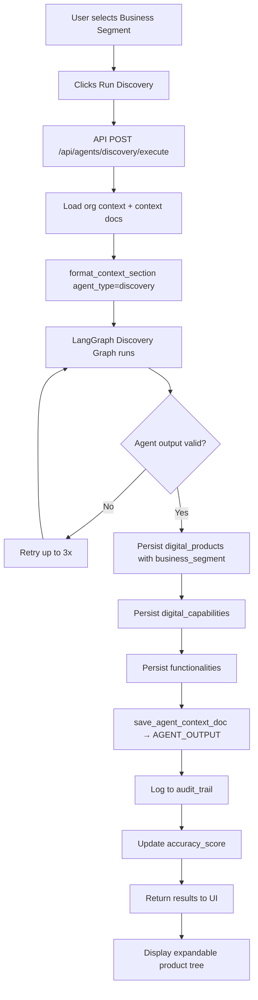
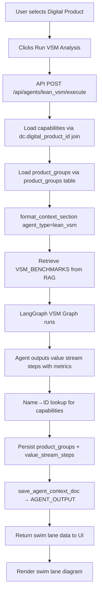
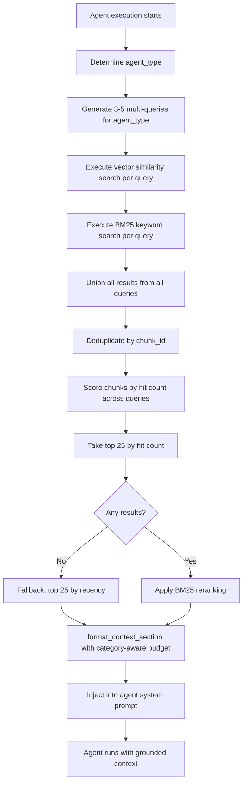
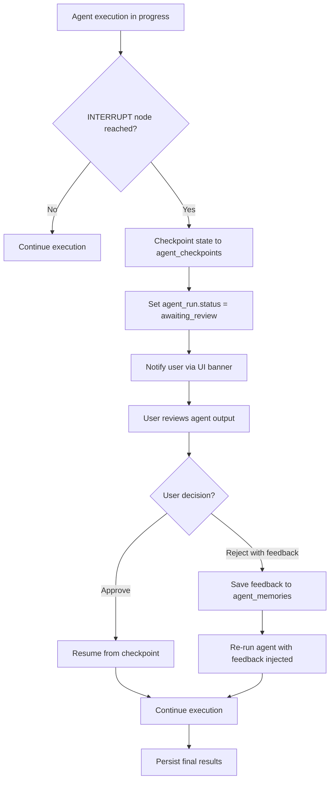

# TransformHub — Functional Architecture

**Version**: 1.0
**Status**: Approved
**Last Updated**: 2026-03-12

---

## Table of Contents

1. [Functional Architecture Overview](#1-functional-architecture-overview)
2. [Business Capability Model](#2-business-capability-model)
3. [Functional Domains](#3-functional-domains)
4. [Cross-Cutting Functions](#4-cross-cutting-functions)
5. [Functional Flow Diagrams](#5-functional-flow-diagrams)
6. [Integration Points](#6-integration-points)
7. [Functional Constraints and Rules](#7-functional-constraints-and-rules)
8. [Business Rules Catalogue](#8-business-rules-catalogue)

---

## 1. Functional Architecture Overview

TransformHub's functional architecture is organised around seven primary domains that collaborate through a shared knowledge fabric. Each domain is served by one or more AI agents that operate as autonomous reasoning units, grounded by a hybrid RAG retrieval pipeline.

```
┌─────────────────────────────────────────────────────────────────┐
│                     PRESENTATION LAYER                          │
│  Next.js 15 (App Router) — Dark Glassmorphism UI               │
│  Dashboard │ Discovery │ VSM │ Future State │ Risk │ Reports    │
└─────────────────────┬───────────────────────────────────────────┘
                      │ REST / Server Actions
┌─────────────────────▼───────────────────────────────────────────┐
│                     API LAYER                                    │
│  FastAPI — 18 agent endpoints + context + org management        │
└──────┬──────────────┬──────────────┬────────────────────────────┘
       │              │              │
┌──────▼──────┐ ┌─────▼──────┐ ┌────▼────────────────────────────┐
│  AGENT      │ │  CONTEXT   │ │  DATA LAYER                     │
│  LAYER      │ │  LAYER     │ │  PostgreSQL 18 + pgvector       │
│  18 LG      │ │  RAG       │ │  Prisma ORM                     │
│  Agents     │ │  Pipeline  │ │  asyncpg                        │
└─────────────┘ └────────────┘ └─────────────────────────────────┘
```

### Layered Functional View

| Layer | Function | Technology |
|-------|----------|------------|
| Presentation | User interaction, visualisation, form capture | Next.js 15, Tailwind v4 |
| API | Request routing, auth, validation, orchestration | FastAPI, NextAuth |
| Agent | AI reasoning, transformation analysis, structured output | LangGraph, OpenAI GPT-4o |
| Context | Knowledge retrieval, document management, embedding | pgvector, BM25, text-embedding-3-small |
| Data | Persistence, querying, transaction management | PostgreSQL 18, Prisma, asyncpg |

---

## 2. Business Capability Model

### Level 1 Capabilities

| Capability | Description |
|------------|-------------|
| C1: Organisation Management | Manage organisations, repositories, segments, and members |
| C2: Digital Discovery | Discover and map digital products and capabilities |
| C3: Value Stream Analysis | Map and analyse current-state value streams |
| C4: Transformation Planning | Generate and manage transformation roadmaps |
| C5: Risk Intelligence | Identify, assess, and manage transformation risks |
| C6: Architecture Intelligence | Recommend technology architectures |
| C7: Knowledge Management | Capture, index, and retrieve organisational knowledge |
| C8: Human Oversight | Review, approve, and provide feedback on AI outputs |
| C9: Learning & Adaptation | Learn from human feedback to improve future outputs |
| C10: Reporting & Intelligence | Generate and distribute executive reports |
| C11: Audit & Compliance | Maintain immutable audit trail of all activities |

### Level 2 Capabilities

| L1 Capability | L2 Sub-Capability |
|---------------|-------------------|
| C1: Org Management | Org Onboarding, Segment Configuration, Repository Management, Member Management |
| C2: Discovery | Product Discovery, Capability Mapping, Functionality Identification, Segment Tagging |
| C3: VSM | Process Step Identification, Cycle Time Analysis, Waste Detection, Efficiency Calculation |
| C4: Transformation | Roadmap Generation, Initiative Prioritisation, Milestone Planning, Dependency Mapping |
| C5: Risk | Risk Identification, Risk Scoring, Regulatory Mapping, Mitigation Planning |
| C6: Architecture | Tech Stack Recommendation, Integration Pattern Design, Migration Planning |
| C7: Knowledge | Document Ingestion, Chunking & Embedding, Semantic Search, Hybrid Retrieval |
| C8: Human Oversight | Gate Configuration, Output Review, Approval Workflow, Feedback Capture |
| C9: Learning | Memory Extraction, Memory Storage, Memory Injection, Accuracy Scoring |
| C10: Reporting | Report Compilation, Visualisation, Export, Distribution |
| C11: Audit | Event Logging, Hash Chaining, Chain Verification, Audit Query |

---

## 3. Functional Domains

### Domain 1: Organisation Management

**Purpose**: Foundation domain providing organisation, repository, and segment management.

**Key Functions**:
- Create and configure organisations with JSONB business_segments
- Manage repositories as logical product groupings
- Configure and rename business segments with cascade updates
- Switch active organisation context

**Inputs**: User-provided org name, description, segments
**Outputs**: Persisted org record, available in context for all other domains
**Dependencies**: Auth system (NextAuth), PostgreSQL

**Data Entities**:
- `organisations` (id, name, description, business_segments JSONB)
- `repositories` (id, organisation_id, name)
- `users`, `accounts`, `sessions` (NextAuth tables)

---

### Domain 2: Discovery Intelligence

**Purpose**: AI-powered discovery of digital products, capabilities, and functionalities.

**Key Functions**:
- Invoke Discovery LangGraph agent with business segment context
- Persist discovered hierarchy: products → capabilities → functionalities
- Tag products with business segment
- Provide editable product tree

**Inputs**: Organisation context, selected business segment, uploaded discovery context docs
**Outputs**: Populated digital_products, digital_capabilities, functionalities tables
**Dependencies**: Organisation Management, Knowledge Management, Agent Orchestration

**Data Entities**:
- `digital_products` (id, repository_id, name, business_segment)
- `digital_capabilities` (id, digital_product_id, name, maturity_level)
- `functionalities` (id, digital_capability_id, name, description)

---

### Domain 3: Value Stream Analysis

**Purpose**: Lean VSM analysis identifying waste, cycle times, and process efficiency.

**Key Functions**:
- Load capabilities and product_groups for selected digital product
- Execute Lean VSM LangGraph agent
- Persist value_stream_steps with metrics
- Display swim-lane diagram
- Auto-save VSM output as AGENT_OUTPUT context doc

**Inputs**: Selected digital product, capabilities, VSM benchmark context docs
**Outputs**: product_groups, value_stream_steps with cycle_time/wait_time/quality_score/automation_level, waste items
**Dependencies**: Discovery Intelligence, Knowledge Management

**Data Entities**:
- `product_groups` (id, digital_product_id, name, process_type)
- `value_stream_steps` (id, product_group_id, name, cycle_time, wait_time, quality_score, automation_level)

---

### Domain 4: Transformation Planning

**Purpose**: Future state roadmap generation grounded in benchmarks and case studies.

**Key Functions**:
- Execute Future State Vision LangGraph agent
- Generate phased transformation roadmap
- Produce projected_metrics with confidence bands
- Compare against industry benchmarks
- Export roadmap as PDF

**Inputs**: VSM results, AGENT_OUTPUT context docs, VSM_BENCHMARKS, TRANSFORMATION_CASE_STUDIES
**Outputs**: Transformation roadmap with phases/activities, projected_metrics (conservative/expected/optimistic)
**Dependencies**: Value Stream Analysis, Knowledge Management

---

### Domain 5: Risk Intelligence

**Purpose**: Automated risk identification, severity scoring, and regulatory mapping.

**Key Functions**:
- Execute Risk & Compliance LangGraph agent
- Score risks by likelihood × impact
- Map to regulatory frameworks (GDPR, SOC2, APRA, etc.)
- Display risk register and heat map

**Inputs**: Digital product and capability context, REGULATORY context docs
**Outputs**: Risk items with category, likelihood, impact, severity, regulatory refs
**Dependencies**: Discovery Intelligence, Knowledge Management

---

### Domain 6: Architecture Intelligence

**Purpose**: Technology architecture recommendations aligned to transformation target state.

**Key Functions**:
- Execute Architecture LangGraph agent
- Recommend technology stack per capability
- Design integration patterns
- Reference uploaded ARCHITECTURE_STANDARDS docs

**Inputs**: Product/capability context, ARCHITECTURE_STANDARDS context docs, future state roadmap
**Outputs**: Architecture recommendations with tech stack, integration patterns, migration approach
**Dependencies**: Discovery Intelligence, Transformation Planning, Knowledge Management

---

### Domain 7: Knowledge Management

**Purpose**: Capture, index, and retrieve organisational knowledge to ground all agent outputs.

**Key Functions**:
- Ingest documents (upload or URL fetch)
- Chunk documents (2k chars, 400 char overlap)
- Embed chunks via OpenAI text-embedding-3-small (1536 dims)
- Store in pgvector
- Execute hybrid BM25 + vector retrieval
- Apply multi-query (3–5 queries per agent_type) with dedup and reranking

**Inputs**: User-uploaded files, URL/GitHub links
**Outputs**: context_documents, context_chunks with embeddings, indexed and retrievable
**Dependencies**: PostgreSQL + pgvector, OpenAI Embeddings API

**Data Entities**:
- `context_documents` (id, organisation_id, title, source_url, category)
- `context_chunks` (id, document_id, chunk_text, chunk_index, embedding vector(1536))

---

## 4. Cross-Cutting Functions

### Authentication & Authorisation

- All API routes protected by NextAuth JWT middleware
- Org-scoped access: all queries filtered by organisation_id
- Session tokens stored in PostgreSQL sessions table
- API keys for service-to-service communication

### Audit Logging

- Every agent run, data mutation, and user action creates an audit_log entry
- SHA-256 hash chaining provides tamper evidence
- Audit trail queryable by org, entity_type, date range

### Error Handling

- Structured error responses: `{ error: string, code: string, details?: object }`
- Agent errors trigger retry (3× exponential backoff)
- Persistent errors saved to agent_runs.status = "failed" with error details
- User-facing error notifications via toast

### Caching

- Accuracy scores: 60-second TTL cache in accuracy_cache table
- RAG retrieval: Not cached (context must be fresh)
- Static org data: React context with manual invalidation

### Notifications

- In-app: HITL gate pauses trigger banner notification
- No external notifications in v1 (email/Slack in v2 roadmap)

---

## 5. Functional Flow Diagrams

### 5.1 Discovery Flow



### 5.2 VSM Analysis Flow



### 5.3 RAG Retrieval Flow



### 5.4 Human Gate Flow



---

## 6. Integration Points

| External System | Protocol | Purpose | Auth Method |
|----------------|----------|---------|-------------|
| OpenAI GPT-4o | HTTPS REST | Agent LLM inference | API Key (env var) |
| OpenAI Embeddings API | HTTPS REST | text-embedding-3-small for chunks | API Key (env var) |
| PostgreSQL 18 | TCP (asyncpg) | Primary data store | Connection string |
| pgvector | PostgreSQL extension | Vector similarity search | Via PostgreSQL connection |
| NextAuth | Library | Session management | JWT secret (env var) |

---

## 7. Functional Constraints and Rules

### FC-001: Org Isolation
All data queries MUST include organisation_id filter. Cross-org data access is prohibited.

### FC-002: Business Segment Required
Discovery Agent MUST have a business segment selected. If not selected, default to organisations.business_segments[0].

### FC-003: DB Hierarchy Integrity
The hierarchy repositories → digital_products → digital_capabilities → functionalities MUST be maintained. No capability can exist without a digital_product parent.

### FC-004: Join Direction
Capabilities are joined via `digital_capabilities.digital_product_id = digital_products.id`, NOT `digital_products.id = digital_capabilities.id`. All agents use this direction.

### FC-005: Context Budget
Total injected context MUST NOT exceed 12k characters per agent run. Category-aware budget allocates higher character budget to primary document types per agent.

### FC-006: Chunk Size
All documents MUST be chunked at 2k characters with 400-character overlap. No chunk may exceed 2k characters.

### FC-007: Audit Completeness
Every agent run and data mutation MUST produce an audit_log entry before the operation is considered complete.

---

## 8. Business Rules Catalogue

| ID | Rule | Domain | Enforcement |
|----|------|--------|-------------|
| BR-001 | Each organisation MUST have at least one business segment | Org Management | API validation |
| BR-002 | Business segment rename MUST cascade to digital_products.business_segment by position | Org Management | PUT /api/organizations/[id] |
| BR-003 | Digital products MUST be tagged with exactly one business_segment | Discovery | Agent persist logic |
| BR-004 | If no segment selected at discovery, use org's first segment | Discovery | graph.py persist_results |
| BR-005 | VSM capabilities MUST be loaded via dc.digital_product_id join | VSM | load_capabilities() |
| BR-006 | VSM persist MUST use name→ID lookup for capabilities (agent returns names, not IDs) | VSM | persist_vsm() |
| BR-007 | Future State projected_metrics MUST include conservative/expected/optimistic bands | Future State | Agent output schema |
| BR-008 | Future State MUST display "Benchmark-grounded" badge when agent provides projected_metrics | Future State | future-state/page.tsx |
| BR-009 | Risk Agent MUST use dc.digital_product_id join (same as VSM rule) | Risk | graph.py |
| BR-010 | All agent runs MUST call format_context_section(input_data, agent_type) | All Agents | Enforced in each graph.py |
| BR-011 | Context max_chars MUST be 12k (not 4k) | Knowledge Mgmt | org_context.py |
| BR-012 | Chunk size MUST be 2k chars, overlap 200→400 chars | Knowledge Mgmt | text-extractor.ts |
| BR-013 | Multi-query RAG MUST generate 3–5 queries per agent_type | Knowledge Mgmt | execute/route.ts |
| BR-014 | Deduped RAG results MUST return top-25 by hit count | Knowledge Mgmt | execute/route.ts |
| BR-015 | Fallback RAG MUST return 25 most recent chunks when no query matches | Knowledge Mgmt | execute/route.ts |
| BR-016 | BM25 reranking MUST be applied in lean_vsm and future_state_vision agents | VSM, Future State | bm25_retrieval.py |
| BR-017 | Agent output MUST be auto-saved as AGENT_OUTPUT category context doc for discovery, vsm, future_state | Context Output | context_output.py |
| BR-018 | Agent memories MUST be injected into system prompt on subsequent runs | Agent Orchestration | agent_memories |
| BR-019 | HITL gate state MUST be checkpointed before INTERRUPT | Agent Orchestration | LangGraph INTERRUPT |
| BR-020 | Accuracy scores MUST be cached for 60 seconds | Reporting | accuracy_cache TTL |
| BR-021 | Accuracy score formula: composite(confidence, source_diversity, run_success, human_edit_rate) | Reporting | Scoring agent |
| BR-022 | Audit log MUST include SHA-256 hash of previous entry | Audit | audit_logs.prev_hash |
| BR-023 | HITL rejection feedback MUST be saved to agent_memories for future runs | Agent Learning | HITL gate handler |
| BR-024 | All API endpoints MUST return structured error: {error, code, details?} | API | FastAPI exception handler |
| BR-025 | Agent retry MUST use exponential backoff: 1s, 2s, 4s | Agent Orchestration | Retry decorator |
| BR-026 | demo org localStorage MUST be clearable via localStorage.removeItem("currentOrgId") | Org Management | OrganizationContext |
| BR-027 | All embeddings MUST use OpenAI text-embedding-3-small (1536 dims) | Knowledge Mgmt | Embedding pipeline |
| BR-028 | Product Transformation Agent MUST use dc.digital_product_id join direction | Product Transform | graph.py |
| BR-029 | Feature flags for v2 features MUST be controlled via environment variables | Platform | Config |
| BR-030 | Health endpoint MUST respond within 200ms | Platform | /api/v1/health |
