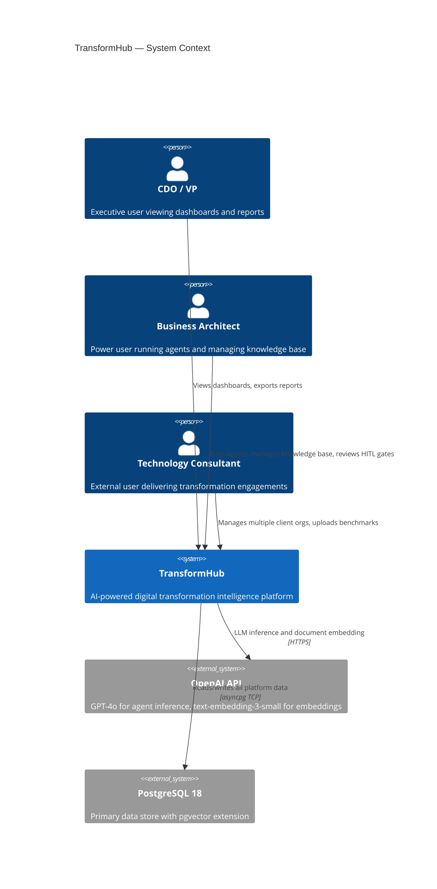
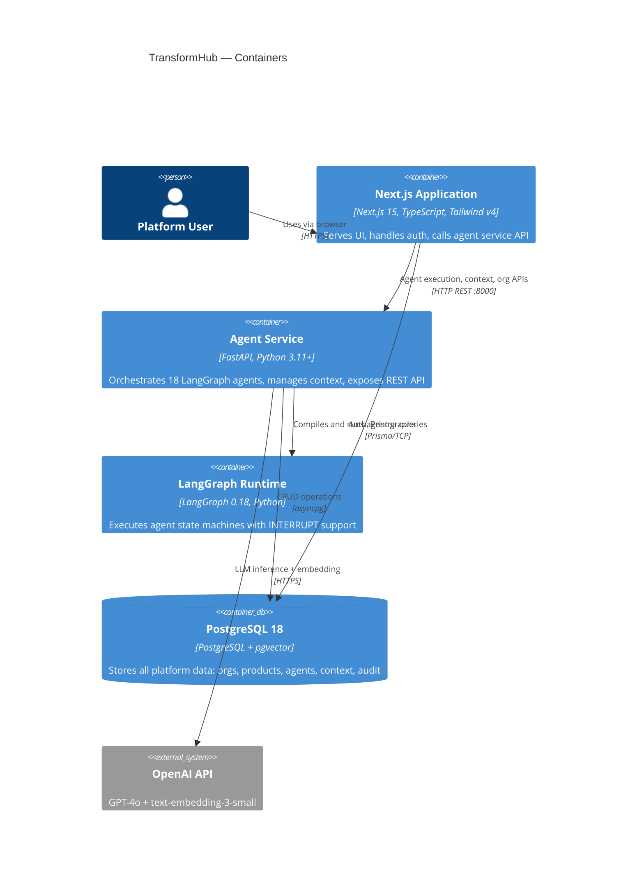
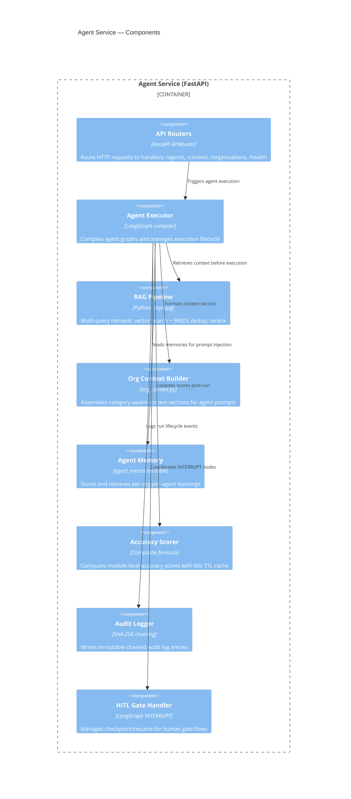
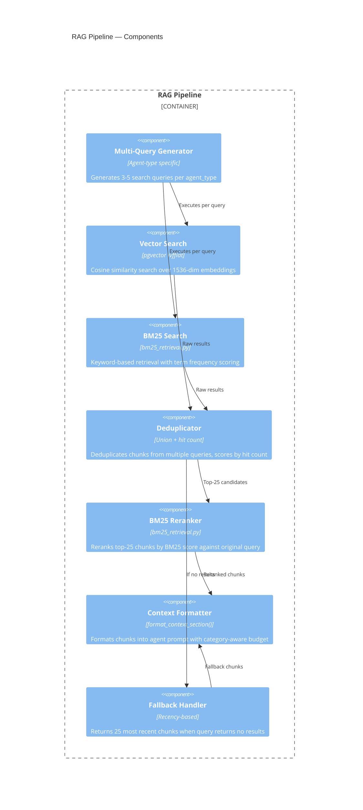

# TransformHub — Technical Architecture

**Version**: 1.0
**Status**: Approved
**Last Updated**: 2026-03-12

---

## Table of Contents

1. [Architecture Overview & Principles](#1-architecture-overview--principles)
2. [System Context (C4 Level 1)](#2-system-context-c4-level-1)
3. [Container Diagram (C4 Level 2)](#3-container-diagram-c4-level-2)
4. [Component Diagrams (C4 Level 3)](#4-component-diagrams-c4-level-3)
5. [Technology Stack](#5-technology-stack)
6. [Frontend Architecture](#6-frontend-architecture)
7. [Backend Architecture](#7-backend-architecture)
8. [Agent Architecture](#8-agent-architecture)
9. [Database Architecture](#9-database-architecture)
10. [RAG Pipeline Architecture](#10-rag-pipeline-architecture)
11. [Security Architecture](#11-security-architecture)
12. [Caching & Performance](#12-caching--performance)
13. [Infrastructure & Deployment](#13-infrastructure--deployment)
14. [API Design Patterns](#14-api-design-patterns)

---

## 1. Architecture Overview & Principles

### Core Principles

| Principle | Description |
|-----------|-------------|
| **Modular Agents** | Each agent owns one transformation domain. Agents communicate only via shared PostgreSQL state, never directly. |
| **RAG-First** | Every agent that reasons about transformation injects context from the knowledge base before generation. No "naked" LLM calls. |
| **Stateless API Layer** | FastAPI instances are stateless. All state lives in PostgreSQL. Horizontal scaling by adding API instances. |
| **Human-in-the-Loop by Design** | HITL gates are a first-class architectural primitive, not an afterthought. LangGraph INTERRUPT nodes are the mechanism. |
| **Audit by Default** | All mutations produce an audit_log entry. The platform is forensically traceable to a board-level standard. |
| **Fail Safe** | Agent failures never corrupt data. State is checkpointed. Rollback is always possible. |
| **Context Isolation** | All data is scoped by organisation_id. No cross-org data leakage is architecturally possible. |

---

## 2. System Context (C4 Level 1)



---

## 3. Container Diagram (C4 Level 2)



---

## 4. Component Diagrams (C4 Level 3)

### 4.1 Agent Service Components



### 4.2 RAG Pipeline Components



---

## 5. Technology Stack

| Layer | Technology | Version | Purpose |
|-------|-----------|---------|---------|
| **Frontend Framework** | Next.js | 15 (App Router) | React SSR + Server Actions |
| **Frontend Language** | TypeScript | 5.x | Type safety |
| **Frontend Styling** | Tailwind CSS | v4 | Utility-first CSS |
| **Frontend Auth** | NextAuth.js | 5.x | Authentication + JWT sessions |
| **Frontend ORM** | Prisma | 5.x | DB schema management + client |
| **Backend Framework** | FastAPI | 0.115+ | Async REST API |
| **Backend Language** | Python | 3.11+ | Agent service |
| **Agent Orchestration** | LangGraph | 0.18 | State machine agent graphs |
| **LLM** | OpenAI GPT-4o | Latest | Agent inference |
| **Embeddings** | text-embedding-3-small | Latest | Document + query embedding |
| **Database** | PostgreSQL | 18 | Primary data store |
| **Vector Search** | pgvector | 0.7+ | Approximate nearest neighbour |
| **Async DB Driver** | asyncpg | 0.29+ | High-performance async PostgreSQL |
| **Python Validation** | Pydantic | v2 | Schema validation |
| **Python HTTP** | httpx | 0.27+ | Async HTTP client |
| **BM25 Engine** | rank_bm25 | 0.2.2 | Keyword retrieval |
| **Node Runtime** | Node.js | 20+ | Next.js runtime |
| **Package Manager** | npm | 10+ | Frontend packages |
| **Python Env** | venv | — | Python dependency isolation |
| **Container** | Docker + Compose | Latest | Local + production deployment |

---

## 6. Frontend Architecture

### 6.1 Next.js App Router Structure

```
nextjs-app/src/
├── app/
│   ├── layout.tsx                    # Root layout (dark theme, sidebar)
│   ├── globals.css                   # Theme variables, #0a0e12 bg
│   ├── page.tsx                      # Dashboard redirect
│   ├── dashboard/page.tsx            # Main dashboard
│   ├── discovery/page.tsx            # Discovery agent UI
│   ├── vsm/page.tsx                  # Value stream map UI
│   ├── future-state/page.tsx         # Future state & roadmap
│   ├── risk/page.tsx                 # Risk register
│   ├── product-transformation/
│   ├── architecture/
│   ├── knowledge-base/               # Context document management
│   ├── reports/
│   ├── settings/
│   │   └── organization/
│   └── api/
│       ├── auth/[...nextauth]/       # NextAuth route
│       ├── context/
│       │   ├── upload/route.ts       # File upload
│       │   ├── fetch-url/route.ts    # URL fetch
│       │   └── execute/route.ts     # RAG retrieval
│       └── organizations/[id]/
├── components/
│   ├── layout/Sidebar.tsx
│   ├── layout/Header.tsx
│   ├── ui/                           # Shared UI primitives
│   └── domain/                       # Domain-specific components
├── contexts/
│   └── OrganizationContext.tsx       # Active org state
├── lib/
│   ├── auth.ts                       # NextAuth config
│   ├── prisma.ts                     # Prisma client singleton
│   └── api.ts                        # FastAPI client helpers
└── types/
    └── index.ts                      # Shared TypeScript types
```

### 6.2 State Management

| State Type | Mechanism | Scope |
|-----------|-----------|-------|
| Active organisation | React Context (OrganizationContext) | App-wide |
| Agent run results | React state (useState) | Page-level |
| Form state | React Hook Form | Component-level |
| Server cache | Next.js cache / revalidatePath | Route-level |
| Auth session | NextAuth useSession | App-wide |
| Org preference | localStorage "currentOrgId" | Persistent |

### 6.3 API Client Pattern

All FastAPI calls go through typed helper functions in `lib/api.ts`:

```typescript
// Example typed API call
const response = await fetch(`${AGENT_SERVICE_URL}/api/v1/agents/discovery/execute`, {
  method: 'POST',
  headers: { 'Content-Type': 'application/json' },
  body: JSON.stringify({ organization_id, business_segment, repository_id })
})
```

---

## 7. Backend Architecture

### 7.1 FastAPI Router Structure

```
agent-service/app/
├── main.py                           # FastAPI app init, CORS, routers
├── core/
│   ├── config.py                     # Settings (extra="ignore" for pool settings)
│   └── database.py                   # asyncpg pool management
├── routers/
│   ├── organizations.py
│   ├── repositories.py
│   ├── digital_products.py
│   ├── agents/
│   │   ├── discovery.py
│   │   ├── lean_vsm.py
│   │   ├── future_state.py
│   │   ├── risk_compliance.py
│   │   ├── product_transformation.py
│   │   └── architecture.py
│   ├── context/
│   │   ├── documents.py
│   │   └── retrieval.py
│   └── health.py
├── agents/
│   ├── discovery/graph.py
│   ├── lean_vsm/graph.py
│   ├── future_state_vision/graph.py
│   ├── risk_compliance/graph.py
│   ├── product_transformation/graph.py
│   ├── architecture/graph.py
│   ├── context/
│   │   ├── org_context.py
│   │   └── context_output.py
│   ├── retrieval/
│   │   └── bm25_retrieval.py
│   └── memory/
│       └── agent_memory.py
└── models/
    └── schemas.py                    # Pydantic v2 models
```

### 7.2 Dependency Injection

FastAPI uses `Depends()` for:
- Database connections (asyncpg pool)
- Current user (from JWT)
- Organisation context validation

### 7.3 CORS Configuration

```python
app.add_middleware(
    CORSMiddleware,
    allow_origins=["http://localhost:3000"],
    allow_credentials=True,
    allow_methods=["*"],
    allow_headers=["*"],
)
```

---

## 8. Agent Architecture

### 8.1 LangGraph State Machine Pattern

Each agent is a LangGraph `StateGraph` with:
- **State schema** (TypedDict): input context, intermediate results, final output
- **Nodes**: async Python functions (each does one reasoning step)
- **Edges**: deterministic transitions + conditional edges for error/retry paths
- **INTERRUPT nodes**: pause execution for HITL gate

```python
# Canonical agent graph structure
from langgraph.graph import StateGraph, END
from langgraph.checkpoint.postgres.aio import AsyncPostgresSaver

builder = StateGraph(AgentState)
builder.add_node("load_context", load_context_node)
builder.add_node("retrieve_rag", retrieve_rag_node)
builder.add_node("generate", generate_node)
builder.add_node("hitl_gate", interrupt_node)  # INTERRUPT
builder.add_node("persist", persist_node)

builder.add_edge("load_context", "retrieve_rag")
builder.add_edge("retrieve_rag", "generate")
builder.add_conditional_edges("generate", route_hitl)
builder.add_edge("hitl_gate", "persist")
builder.add_edge("persist", END)

checkpointer = AsyncPostgresSaver(pool)
graph = builder.compile(checkpointer=checkpointer, interrupt_before=["hitl_gate"])
```

### 8.2 Agent Node Types

| Node Type | Description | Examples |
|-----------|-------------|---------|
| Load Context | Fetch org data and existing outputs from DB | load_capabilities, load_context |
| RAG Retrieval | Execute multi-query hybrid retrieval | retrieve_rag |
| Generate | Call OpenAI with formatted prompt | generate, analyse |
| Validate | Schema-validate agent output | validate_output |
| Persist | Write results to PostgreSQL | persist_results, persist_vsm |
| INTERRUPT | Pause for human gate | hitl_gate |
| Memory | Save learnings to agent_memories | save_memory |
| Audit | Write audit log entry | log_audit |

### 8.3 Shared Agent Pattern

All 18 agents follow this canonical flow:
1. `load_context` → load org, product, capability data
2. `retrieve_rag` → multi-query hybrid RAG retrieval
3. `format_context` → `format_context_section(input_data, agent_type)`
4. `generate` → OpenAI GPT-4o inference with formatted prompt
5. `validate` → Pydantic schema validation of output
6. `hitl_gate` → Optional INTERRUPT for human review
7. `persist` → Write to PostgreSQL
8. `save_output_to_context` → Auto-save as AGENT_OUTPUT context doc
9. `audit` → SHA-256 chained audit log entry
10. `update_accuracy` → Recompute accuracy score

---

## 9. Database Architecture

### 9.1 Schema Overview

```
organizations
  ├── id (UUID PK)
  ├── name, description
  └── business_segments (JSONB array)
        │
        └── repositories
              ├── id (UUID PK)
              └── organization_id (FK)
                    │
                    └── digital_products
                          ├── id (UUID PK)
                          ├── repository_id (FK)
                          └── business_segment (TEXT)
                                │
                                ├── digital_capabilities
                                │     ├── id (UUID PK)
                                │     └── digital_product_id (FK)
                                │           │
                                │           └── functionalities
                                │                 └── digital_capability_id (FK)
                                └── product_groups
                                      ├── id (UUID PK)
                                      └── digital_product_id (FK)
                                            │
                                            └── value_stream_steps
                                                  └── product_group_id (FK)
```

### 9.2 Indexing Strategy

| Table | Index | Type | Rationale |
|-------|-------|------|-----------|
| context_chunks | embedding | ivfflat (lists=100) | Approximate nearest neighbour for vector search |
| context_chunks | document_id | btree | Chunk retrieval by document |
| context_documents | organization_id, category | btree composite | Filtered category retrieval |
| digital_products | repository_id, business_segment | btree composite | Segment-filtered product queries |
| digital_capabilities | digital_product_id | btree | Capability join performance |
| agent_runs | organization_id, agent_type, started_at | btree composite | Run history queries |
| audit_logs | organization_id, created_at | btree composite | Audit queries by org and time |
| agent_memories | organization_id, agent_type | btree composite | Memory retrieval per agent run |
| accuracy_cache | organization_id, agent_type, computed_at | btree composite | Cache lookup + TTL query |

### 9.3 pgvector Configuration

```sql
-- Index creation for context_chunks.embedding
CREATE INDEX ON context_chunks
USING ivfflat (embedding vector_cosine_ops)
WITH (lists = 100);

-- Query time: set probes for recall/performance balance
SET ivfflat.probes = 10;
```

- **Dimensions**: 1536 (text-embedding-3-small)
- **Index type**: ivfflat (lists=100) — good for up to 1M vectors
- **Similarity**: cosine (normalised vectors)
- **Probes at query time**: 10 (balance of recall vs speed)
- **Migration to HNSW**: Planned for v1.1 when dataset exceeds 1M chunks

---

## 10. RAG Pipeline Architecture

### 10.1 Document Ingestion Pipeline

```
File/URL Input
     │
     ▼
Text Extraction (text-extractor.ts)
- PDF: pdf-parse
- DOCX: mammoth
- Markdown/TXT: direct
     │
     ▼
Chunking
- chunk_size: 2000 chars
- chunk_overlap: 400 chars
     │
     ▼
Embedding (OpenAI text-embedding-3-small)
- 1536 dimensions per chunk
- Batch size: 100 chunks
     │
     ▼
Storage (PostgreSQL + pgvector)
- context_documents record created
- context_chunks records created with embedding
```

### 10.2 Retrieval Pipeline

```
Agent Execution Triggered
     │
     ▼
Multi-Query Generation (execute/route.ts)
- 3-5 queries based on agent_type
- Discovery: ["digital products in [segment]", "capability map for [org]", ...]
- VSM: ["value stream steps for [product]", "cycle time benchmarks", ...]
     │
     ▼
Parallel Search (per query)
├── Vector Search: cosine similarity against embedding
└── BM25 Search: term-frequency keyword search
     │
     ▼
Union + Deduplication
- All chunks from all queries unioned
- Deduplicated by chunk_id
- Scored by hit_count (how many queries returned this chunk)
     │
     ▼
Top-25 Selection (by hit_count)
     │
     ▼
BM25 Reranking (bm25_retrieval.py)
- Applied in lean_vsm, future_state_vision agents
     │
     ▼
Context Formatting (org_context.py)
- format_context_section(input_data, agent_type)
- Category-aware budget: 12k total chars
- Higher budget for primary doc type per agent_type
     │
     ▼
Prompt Injection
- Formatted context injected into agent system prompt
```

---

## 11. Security Architecture

### 11.1 Authentication

- **Provider**: NextAuth.js v5 with CredentialsProvider (email/password)
- **Session storage**: JWT tokens + database sessions table
- **Token**: HS256 JWT with org membership claims
- **Cookie**: httpOnly, Secure, SameSite=Lax

### 11.2 Authorisation

- All API routes require valid JWT session
- Every database query includes `WHERE organization_id = $1` using session org
- No admin bypass in application code — privilege is DB-level for schema migrations only
- FastAPI dependency `get_current_org_id()` validates JWT and extracts org_id

### 11.3 API Security

- CORS restricted to `http://localhost:3000` in development; configurable for production
- Input validation via Pydantic v2 models on all request bodies
- SQL injection prevention: all queries use parameterised asyncpg statements
- XSS prevention: React default escaping + Next.js headers (X-Frame-Options, CSP)

### 11.4 Secrets Management

| Secret | Storage | Rotation |
|--------|---------|---------|
| OPENAI_API_KEY | Environment variable | Manual |
| DATABASE_URL | Environment variable | Via ops team |
| NEXTAUTH_SECRET | Environment variable | Manual |
| NEXTAUTH_URL | Environment variable | Per deployment |

### 11.5 Audit Trail

- Every agent run writes to `audit_logs` with SHA-256 hash of `prev_hash + payload`
- Chain integrity verifiable by sequential hash verification
- audit_logs table is INSERT-only in application code (no UPDATE/DELETE)

---

## 12. Caching & Performance

| Cache Type | Mechanism | TTL | Data |
|-----------|-----------|-----|------|
| Accuracy scores | accuracy_cache PostgreSQL table | 60 seconds | Per-module accuracy composites |
| Organisation list | React Context | Session lifetime | Org selector data |
| Prisma query cache | Prisma built-in | Per-request | Schema metadata |
| pgvector index | PostgreSQL shared_buffers | OS managed | Vector index pages |

### Connection Pooling

- asyncpg pool: min=5, max=20 connections
- Prisma pool: configurable via DATABASE_URL pool params
- `config.py` uses `extra = "ignore"` to allow pool-related env vars without Pydantic validation errors

---

## 13. Infrastructure & Deployment

### 13.1 Local Development

```bash
# Agent service
cd agent-service
source venv/bin/activate
uvicorn app.main:app --reload --port 8000

# Next.js app
cd nextjs-app
npm run dev  # :3000
```

### 13.2 Docker Compose (Production-like)

```yaml
services:
  nextjs:
    build: ./nextjs-app
    ports: ["3000:3000"]
    environment:
      - DATABASE_URL=...
      - NEXTAUTH_SECRET=...
      - AGENT_SERVICE_URL=http://agent-service:8000

  agent-service:
    build: ./agent-service
    ports: ["8000:8000"]
    environment:
      - DATABASE_URL=...
      - OPENAI_API_KEY=...

  postgres:
    image: pgvector/pgvector:pg18
    ports: ["5432:5432"]
    volumes: ["pgdata:/var/lib/postgresql/data"]
```

### 13.3 Health Checks

- `GET /api/v1/health` — returns `{ status: "ok", db: "connected", agents: N }` in < 200ms
- Liveness probe: HTTP GET /api/v1/health
- Readiness probe: HTTP GET /api/v1/health (same)

---

## 14. API Design Patterns

### 14.1 URL Structure

```
/api/v1/                              # API version prefix
  health                              # Platform health
  organizations/                      # Org management
  repositories/                       # Repository management
  agents/
    discovery/execute                 # Discovery agent
    lean-vsm/execute                  # VSM agent
    future-state/execute              # Future state agent
    risk-compliance/execute           # Risk agent
    product-transformation/execute    # Product transform agent
    architecture/execute              # Architecture agent
  context/
    documents/                        # Document CRUD
    upload                            # File upload
    fetch-url                         # URL fetch
    execute                           # RAG retrieval
  accuracy/                           # Accuracy scores
  audit/                              # Audit log queries
```

### 14.2 Error Response Schema

```json
{
  "error": "Human-readable error message",
  "code": "MACHINE_READABLE_CODE",
  "details": { "field": "additional context" }
}
```

### 14.3 Pagination

```
GET /api/v1/context/documents?page=1&page_size=20&category=VSM_BENCHMARKS
Response: { items: [...], total: 150, page: 1, page_size: 20, pages: 8 }
```

### 14.4 Agent Execution Request/Response

```json
// Request
POST /api/v1/agents/discovery/execute
{
  "organization_id": "uuid",
  "repository_id": "uuid",
  "business_segment": "Retail Banking",
  "context": {}
}

// Response
{
  "run_id": "uuid",
  "status": "completed",
  "accuracy_score": 87,
  "output": { ... agent-specific output ... },
  "context_doc_id": "uuid"
}
```
