# TransformHub — Sequence Diagrams

**Version**: 1.0
**Status**: Approved
**Last Updated**: 2026-03-12

---

## Table of Contents

1. [User Authentication Flow](#1-user-authentication-flow)
2. [Organisation Setup Flow](#2-organisation-setup-flow)
3. [Discovery Agent Execution Flow](#3-discovery-agent-execution-flow)
4. [VSM Analysis Flow](#4-vsm-analysis-flow)
5. [Future State Vision Flow](#5-future-state-vision-flow)
6. [RAG Document Upload Flow](#6-rag-document-upload-flow)
7. [RAG Retrieval Flow During Agent Execution](#7-rag-retrieval-flow-during-agent-execution)
8. [Human-in-the-Loop Gate Flow](#8-human-in-the-loop-gate-flow)
9. [Agent Memory Learning Flow](#9-agent-memory-learning-flow)
10. [Accuracy Score Calculation Flow](#10-accuracy-score-calculation-flow)
11. [Executive Report Generation Flow](#11-executive-report-generation-flow)
12. [Context Document Fetch-URL Flow](#12-context-document-fetch-url-flow)

---

## 1. User Authentication Flow

**Description**: Covers the complete authentication journey from login form submission through JWT session creation and redirect to the dashboard. NextAuth handles session lifecycle and stores sessions in PostgreSQL.

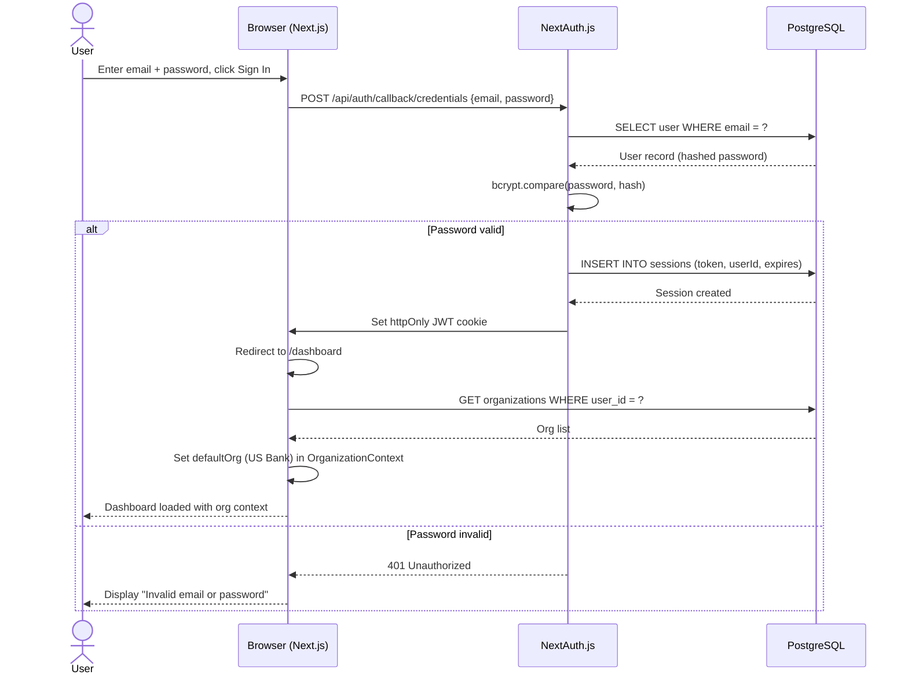

---

## 2. Organisation Setup Flow

**Description**: User creates a new organisation, configures business segments, and creates a repository. All data is persisted via the Next.js API routes which call FastAPI for agent-related operations, and Prisma for structural data.

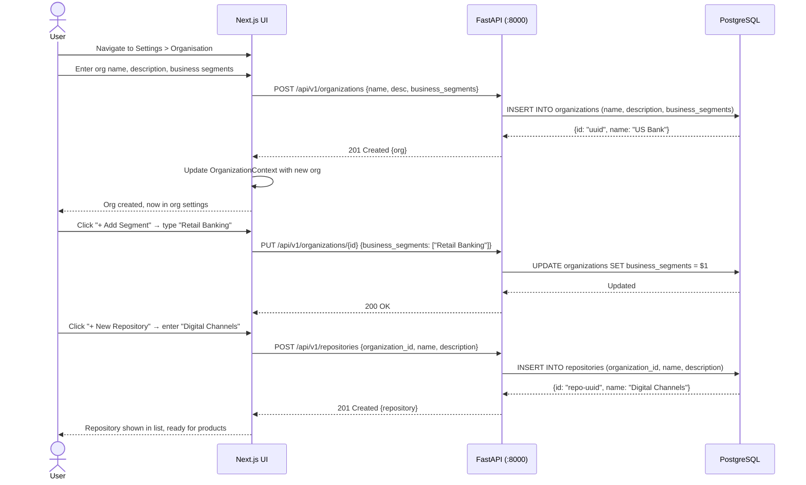

---

## 3. Discovery Agent Execution Flow

**Description**: Full flow of the Discovery LangGraph agent from user trigger through AI analysis, result persistence, context doc auto-save, and accuracy score update.

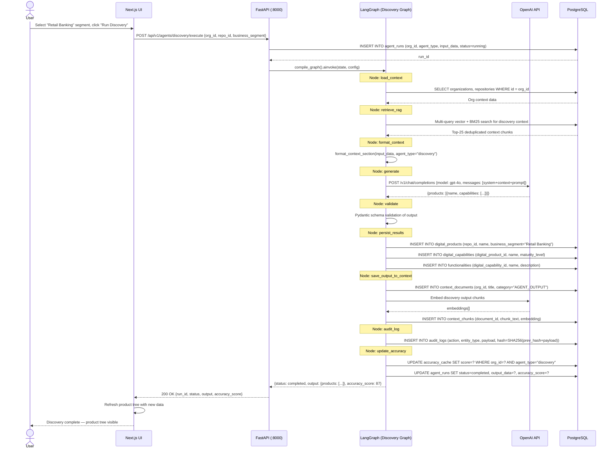

---

## 4. VSM Analysis Flow

**Description**: Lean VSM agent loads capabilities for a product, runs analysis to identify value stream steps and waste, persists results, and auto-saves as context.

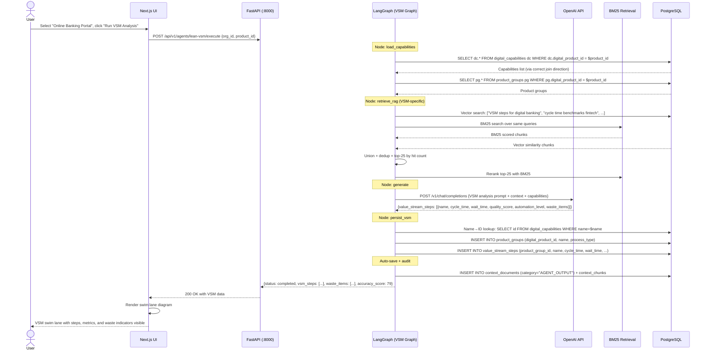

---

## 5. Future State Vision Flow

**Description**: Future State agent uses VSM output and uploaded benchmarks to generate a transformation roadmap with projected metrics including conservative/expected/optimistic bands.

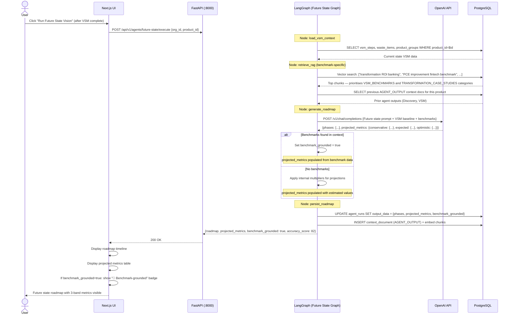

---

## 6. RAG Document Upload Flow

**Description**: User uploads a document (PDF/DOCX/TXT/MD), it is extracted, chunked, embedded, and stored in pgvector for use in future agent runs.

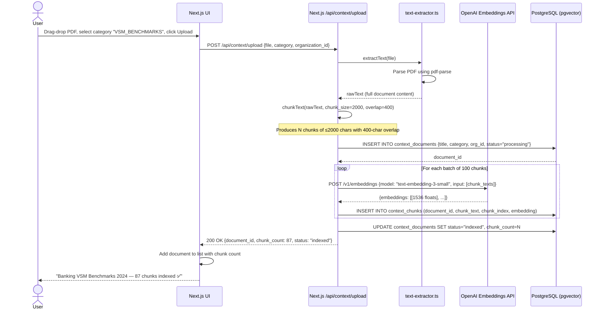

---

## 7. RAG Retrieval Flow During Agent Execution

**Description**: The hybrid multi-query RAG retrieval executed at the start of every agent run, combining vector similarity and BM25 keyword search with deduplication and reranking.

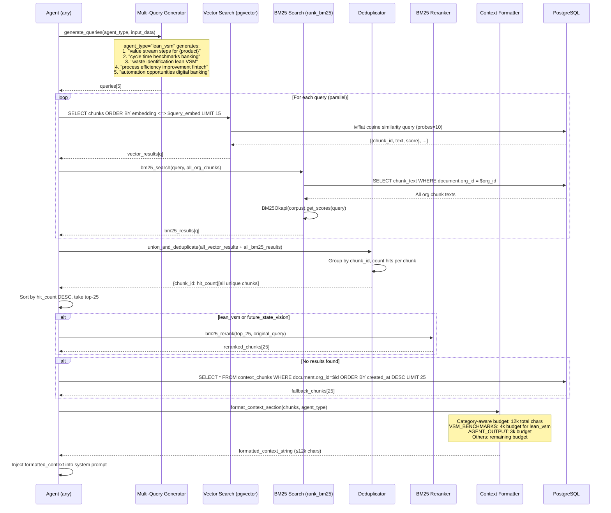

---

## 8. Human-in-the-Loop Gate Flow

**Description**: LangGraph INTERRUPT node pauses agent execution for human review. State is checkpointed to PostgreSQL. User reviews draft output and either approves (resume) or rejects with feedback (re-run with feedback injected).

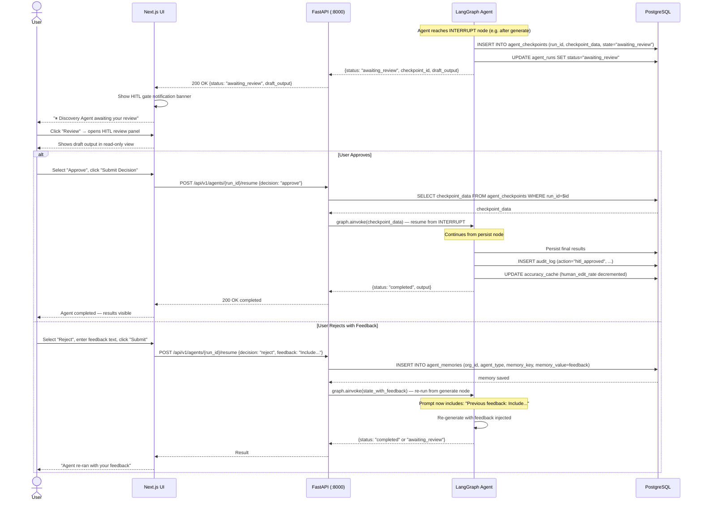

---

## 9. Agent Memory Learning Flow

**Description**: After each agent run with HITL interactions, learnings are extracted and stored in agent_memories table. These are injected into the system prompt for future runs of the same agent within the same organisation.

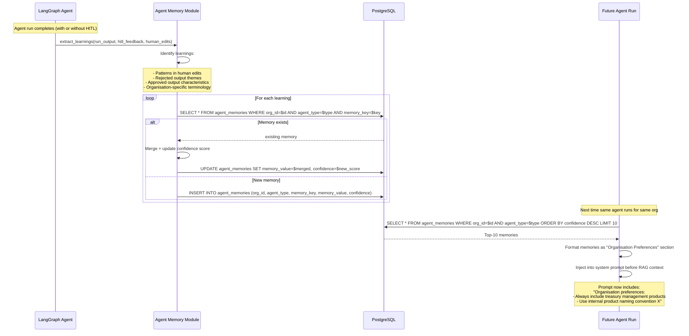

---

## 10. Accuracy Score Calculation Flow

**Description**: Composite accuracy score calculation triggered after each agent run, using a weighted formula across four components. Scores are cached for 60 seconds.

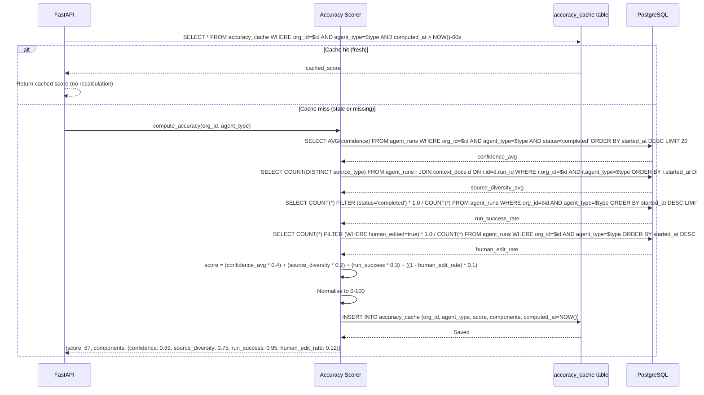

---

## 11. Executive Report Generation Flow

**Description**: Executive Reporting Agent compiles all completed agent outputs into a structured C-suite report with confidence scores, visualisation data, and export capability.

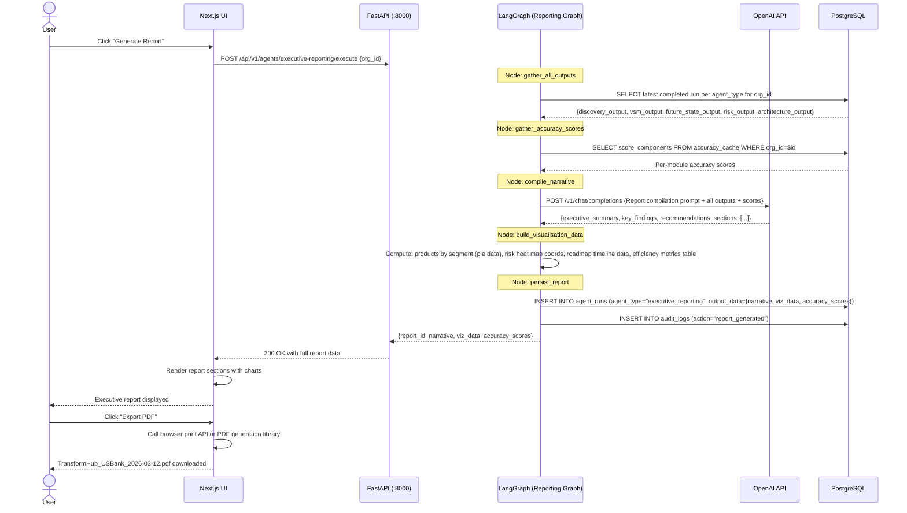

---

## 12. Context Document Fetch-URL Flow

**Description**: User provides a URL (web page or GitHub markdown), the backend fetches content, strips navigation/ads, chunks, embeds, and stores for RAG use.

```mermaid
sequenceDiagram
    actor User
    participant UI as Next.js UI
    participant FetchAPI as Next.js /api/context/fetch-url
    participant HTTPClient as httpx (async)
    participant Parser as Content Parser
    participant OpenAI as OpenAI Embeddings API
    participant DB as PostgreSQL

    User->>UI: Enter URL "https://github.com/org/repo/blob/main/benchmarks.md"
    User->>UI: Select category "VSM_BENCHMARKS", click "Fetch Content"
    UI->>FetchAPI: POST /api/context/fetch-url {url, category, organization_id}

    FetchAPI->>FetchAPI: Validate URL format (must be http/https)
    FetchAPI->>HTTPClient: GET {url} (timeout=30s, headers={User-Agent})

    alt URL is GitHub markdown
        HTTPClient->>HTTPClient: Transform to raw.githubusercontent.com URL
        HTTPClient-->>FetchAPI: Raw markdown content
        FetchAPI->>Parser: parse_markdown(content)
        Parser-->>FetchAPI: cleaned_text
    else URL is web page
        HTTPClient-->>FetchAPI: HTML content
        FetchAPI->>Parser: parse_html(html) using BeautifulSoup
        Parser->>Parser: Extract <main>, <article>, <body>; strip nav, footer, ads
        Parser-->>FetchAPI: cleaned_text
    end

    FetchAPI->>FetchAPI: chunkText(cleaned_text, chunk_size=2000, overlap=400)
    FetchAPI->>DB: INSERT INTO context_documents {title=url_title, source_url=url, category, org_id}
    DB-->>FetchAPI: document_id

    loop Embed chunks in batches of 100
        FetchAPI->>OpenAI: POST /v1/embeddings {model: "text-embedding-3-small", input: batch}
        OpenAI-->>FetchAPI: embeddings[]
        FetchAPI->>DB: INSERT INTO context_chunks (document_id, chunk_text, chunk_index, embedding)
    end

    FetchAPI->>DB: UPDATE context_documents SET status="indexed", chunk_count=N
    FetchAPI-->>UI: 200 OK {document_id, title, chunk_count, status: "indexed"}
    UI->>UI: Add document to knowledge base list
    UI-->>User: "benchmarks.md — 42 chunks indexed ✅"
