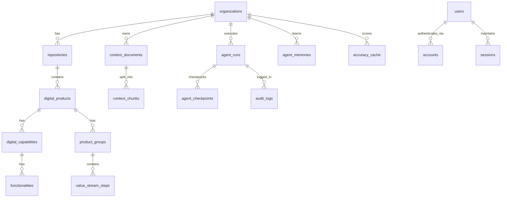

# TransformHub — Data Model

**Version**: 1.0
**Status**: Approved
**Last Updated**: 2026-03-12

---

## Table of Contents

1. [Entity Relationship Overview](#1-entity-relationship-overview)
2. [Table Definitions](#2-table-definitions)
3. [Data Dictionary](#3-data-dictionary)
4. [Index Strategy](#4-index-strategy)
5. [pgvector Configuration](#5-pgvector-configuration)
6. [Data Retention & Archival Policy](#6-data-retention--archival-policy)
7. [Migration Strategy](#7-migration-strategy)

---

## 1. Entity Relationship Overview



---

## 2. Table Definitions

### 2.1 organisations

**Purpose**: Root entity for multi-tenancy. All data scoped by organisation.
**Estimated Volume**: 10–500 rows

| Column | Type | Nullable | Default | Description |
|--------|------|----------|---------|-------------|
| id | UUID | NOT NULL | gen_random_uuid() | Primary key |
| name | TEXT | NOT NULL | — | Organisation display name |
| description | TEXT | NULL | — | Optional description |
| business_segments | JSONB | NOT NULL | '[]' | Ordered array of segment names |
| created_at | TIMESTAMPTZ | NOT NULL | NOW() | Creation timestamp |
| updated_at | TIMESTAMPTZ | NOT NULL | NOW() | Last update timestamp |

**Constraints**:
- PK: id
- UNIQUE: name

**Example business_segments**: `["Retail Banking", "Institutional Banking", "Wealth Management"]`

---

### 2.2 repositories

**Purpose**: Logical grouping of digital products within an organisation.
**Estimated Volume**: 1–20 per org, 1,000–10,000 total

| Column | Type | Nullable | Default | Description |
|--------|------|----------|---------|-------------|
| id | UUID | NOT NULL | gen_random_uuid() | Primary key |
| organization_id | UUID | NOT NULL | — | FK → organisations.id |
| name | TEXT | NOT NULL | — | Repository name |
| description | TEXT | NULL | — | Optional description |
| created_at | TIMESTAMPTZ | NOT NULL | NOW() | Creation timestamp |
| updated_at | TIMESTAMPTZ | NOT NULL | NOW() | Last update timestamp |

**Constraints**:
- PK: id
- FK: organization_id → organisations(id) ON DELETE CASCADE
- UNIQUE: (organization_id, name)

---

### 2.3 digital_products

**Purpose**: Digital products discovered or manually added within a repository, tagged with business segment.
**Estimated Volume**: 5–500 per repo, 50,000–500,000 total

| Column | Type | Nullable | Default | Description |
|--------|------|----------|---------|-------------|
| id | UUID | NOT NULL | gen_random_uuid() | Primary key |
| repository_id | UUID | NOT NULL | — | FK → repositories.id |
| name | TEXT | NOT NULL | — | Product name |
| description | TEXT | NULL | — | Product description |
| business_segment | TEXT | NULL | — | Business segment tag (from org.business_segments) |
| created_at | TIMESTAMPTZ | NOT NULL | NOW() | Creation timestamp |
| updated_at | TIMESTAMPTZ | NOT NULL | NOW() | Last update timestamp |

**Constraints**:
- PK: id
- FK: repository_id → repositories(id) ON DELETE CASCADE
- UNIQUE: (repository_id, name)

**Notes**: business_segment is a soft reference to organisations.business_segments values (not a FK constraint — JSONB array does not support FK constraints). Cascade rename handled at application layer.

---

### 2.4 digital_capabilities

**Purpose**: Capabilities of a digital product, representing functional groupings of functionality.
**Estimated Volume**: 3–20 per product, 500,000+ total

| Column | Type | Nullable | Default | Description |
|--------|------|----------|---------|-------------|
| id | UUID | NOT NULL | gen_random_uuid() | Primary key |
| digital_product_id | UUID | NOT NULL | — | FK → digital_products.id |
| name | TEXT | NOT NULL | — | Capability name |
| description | TEXT | NULL | — | Capability description |
| maturity_level | TEXT | NULL | — | Maturity level: initial / developing / defined / managed / optimising |
| created_at | TIMESTAMPTZ | NOT NULL | NOW() | Creation timestamp |
| updated_at | TIMESTAMPTZ | NOT NULL | NOW() | Last update timestamp |

**Constraints**:
- PK: id
- FK: digital_product_id → digital_products(id) ON DELETE CASCADE
- CHECK: maturity_level IN ('initial', 'developing', 'defined', 'managed', 'optimising')

**Critical Note**: Join direction is always `digital_capabilities.digital_product_id = digital_products.id`, never reversed. All agents enforce this.

---

### 2.5 functionalities

**Purpose**: Individual functionalities within a digital capability.
**Estimated Volume**: 3–15 per capability, millions total

| Column | Type | Nullable | Default | Description |
|--------|------|----------|---------|-------------|
| id | UUID | NOT NULL | gen_random_uuid() | Primary key |
| digital_capability_id | UUID | NOT NULL | — | FK → digital_capabilities.id |
| name | TEXT | NOT NULL | — | Functionality name |
| description | TEXT | NULL | — | Functionality description |
| created_at | TIMESTAMPTZ | NOT NULL | NOW() | Creation timestamp |
| updated_at | TIMESTAMPTZ | NOT NULL | NOW() | Last update timestamp |

**Constraints**:
- PK: id
- FK: digital_capability_id → digital_capabilities(id) ON DELETE CASCADE

---

### 2.6 product_groups

**Purpose**: Process groupings within a digital product for VSM swim lanes.
**Estimated Volume**: 1–5 per product, hundreds of thousands total

| Column | Type | Nullable | Default | Description |
|--------|------|----------|---------|-------------|
| id | UUID | NOT NULL | gen_random_uuid() | Primary key |
| digital_product_id | UUID | NOT NULL | — | FK → digital_products.id |
| name | TEXT | NOT NULL | — | Process group name |
| process_type | TEXT | NULL | — | Type: development / operations / support / etc. |
| created_at | TIMESTAMPTZ | NOT NULL | NOW() | Creation timestamp |
| updated_at | TIMESTAMPTZ | NOT NULL | NOW() | Last update timestamp |

**Constraints**:
- PK: id
- FK: digital_product_id → digital_products(id) ON DELETE CASCADE

---

### 2.7 value_stream_steps

**Purpose**: Individual steps within a value stream (product group), with lean metrics.
**Estimated Volume**: 3–15 per group, millions total

| Column | Type | Nullable | Default | Description |
|--------|------|----------|---------|-------------|
| id | UUID | NOT NULL | gen_random_uuid() | Primary key |
| product_group_id | UUID | NOT NULL | — | FK → product_groups.id |
| name | TEXT | NOT NULL | — | Step name |
| sequence_order | INTEGER | NOT NULL | — | Order in process flow |
| cycle_time | FLOAT | NULL | — | Active work time in hours |
| wait_time | FLOAT | NULL | — | Queue/wait time in hours |
| quality_score | FLOAT | NULL | — | Quality metric 0.0–1.0 |
| automation_level | FLOAT | NULL | — | Automation % 0.0–1.0 |
| waste_items | JSONB | NULL | '[]' | Array of {category, description, impact} |
| created_at | TIMESTAMPTZ | NOT NULL | NOW() | Creation timestamp |
| updated_at | TIMESTAMPTZ | NOT NULL | NOW() | Last update timestamp |

**Constraints**:
- PK: id
- FK: product_group_id → product_groups(id) ON DELETE CASCADE
- CHECK: quality_score BETWEEN 0.0 AND 1.0
- CHECK: automation_level BETWEEN 0.0 AND 1.0

---

### 2.8 context_documents

**Purpose**: Metadata for knowledge base documents (uploaded files or fetched URLs).
**Estimated Volume**: 10–10,000 per org

| Column | Type | Nullable | Default | Description |
|--------|------|----------|---------|-------------|
| id | UUID | NOT NULL | gen_random_uuid() | Primary key |
| organization_id | UUID | NOT NULL | — | FK → organisations.id |
| title | TEXT | NOT NULL | — | Display title |
| source_url | TEXT | NULL | — | Source URL (for URL-fetched docs) |
| file_path | TEXT | NULL | — | Storage path (for uploaded files) |
| category | TEXT | NOT NULL | 'GENERAL' | Category: VSM_BENCHMARKS / TRANSFORMATION_CASE_STUDIES / ARCHITECTURE_STANDARDS / AGENT_OUTPUT / REGULATORY / GENERAL |
| status | TEXT | NOT NULL | 'processing' | Status: processing / indexed / failed |
| chunk_count | INTEGER | NULL | — | Number of chunks created |
| created_at | TIMESTAMPTZ | NOT NULL | NOW() | Creation timestamp |
| updated_at | TIMESTAMPTZ | NOT NULL | NOW() | Last update timestamp |

**Constraints**:
- PK: id
- FK: organization_id → organisations(id) ON DELETE CASCADE
- CHECK: category IN ('VSM_BENCHMARKS', 'TRANSFORMATION_CASE_STUDIES', 'ARCHITECTURE_STANDARDS', 'AGENT_OUTPUT', 'REGULATORY', 'GENERAL')
- CHECK: status IN ('processing', 'indexed', 'failed')

---

### 2.9 context_chunks

**Purpose**: Individual text chunks from context documents with vector embeddings for semantic search.
**Estimated Volume**: 50–500 per document, millions total (pgvector critical table)

| Column | Type | Nullable | Default | Description |
|--------|------|----------|---------|-------------|
| id | UUID | NOT NULL | gen_random_uuid() | Primary key |
| document_id | UUID | NOT NULL | — | FK → context_documents.id |
| chunk_text | TEXT | NOT NULL | — | Raw text of chunk (max ~2000 chars) |
| chunk_index | INTEGER | NOT NULL | — | Position within document (0-based) |
| embedding | vector(1536) | NULL | — | OpenAI text-embedding-3-small embedding |
| created_at | TIMESTAMPTZ | NOT NULL | NOW() | Creation timestamp |

**Constraints**:
- PK: id
- FK: document_id → context_documents(id) ON DELETE CASCADE

**Index**: ivfflat on embedding (vector_cosine_ops), lists=100 — enables ANN search

---

### 2.10 agent_runs

**Purpose**: Record of every agent execution with inputs, outputs, status, and accuracy.
**Estimated Volume**: 5–1,000 per org, millions total

| Column | Type | Nullable | Default | Description |
|--------|------|----------|---------|-------------|
| id | UUID | NOT NULL | gen_random_uuid() | Primary key |
| organization_id | UUID | NOT NULL | — | FK → organisations.id |
| agent_type | TEXT | NOT NULL | — | Agent identifier: discovery / lean_vsm / future_state_vision / etc. |
| input_data | JSONB | NOT NULL | '{}' | Serialised input parameters |
| output_data | JSONB | NULL | — | Serialised agent output |
| status | TEXT | NOT NULL | 'running' | Status: running / awaiting_review / completed / failed |
| accuracy_score | FLOAT | NULL | — | Accuracy score 0.0–1.0 at time of completion |
| human_edited | BOOLEAN | NOT NULL | false | Whether human edited output at HITL gate |
| started_at | TIMESTAMPTZ | NOT NULL | NOW() | Execution start time |
| completed_at | TIMESTAMPTZ | NULL | — | Execution completion time |

**Constraints**:
- PK: id
- FK: organization_id → organisations(id) ON DELETE CASCADE
- CHECK: status IN ('running', 'awaiting_review', 'completed', 'failed')
- CHECK: accuracy_score BETWEEN 0.0 AND 1.0

---

### 2.11 agent_memories

**Purpose**: Persistent per-org per-agent learnings injected into future agent prompts.
**Estimated Volume**: 0–100 per (org, agent_type)

| Column | Type | Nullable | Default | Description |
|--------|------|----------|---------|-------------|
| id | UUID | NOT NULL | gen_random_uuid() | Primary key |
| organization_id | UUID | NOT NULL | — | FK → organisations.id |
| agent_type | TEXT | NOT NULL | — | Agent type this memory applies to |
| memory_key | TEXT | NOT NULL | — | Semantic key/topic of the memory |
| memory_value | TEXT | NOT NULL | — | The learning content |
| confidence | FLOAT | NOT NULL | 0.5 | Confidence in this memory 0.0–1.0 |
| created_at | TIMESTAMPTZ | NOT NULL | NOW() | When memory was first created |
| updated_at | TIMESTAMPTZ | NOT NULL | NOW() | When memory was last updated |

**Constraints**:
- PK: id
- FK: organization_id → organisations(id) ON DELETE CASCADE
- UNIQUE: (organization_id, agent_type, memory_key)
- CHECK: confidence BETWEEN 0.0 AND 1.0

---

### 2.12 agent_checkpoints

**Purpose**: LangGraph state checkpoints for HITL gate pause/resume.
**Estimated Volume**: 0–5 per agent_run (most have 0 or 1)

| Column | Type | Nullable | Default | Description |
|--------|------|----------|---------|-------------|
| id | UUID | NOT NULL | gen_random_uuid() | Primary key |
| run_id | UUID | NOT NULL | — | FK → agent_runs.id |
| checkpoint_data | JSONB | NOT NULL | — | Serialised LangGraph state |
| state | TEXT | NOT NULL | — | Checkpoint state: awaiting_review / resumed / abandoned |
| created_at | TIMESTAMPTZ | NOT NULL | NOW() | When checkpoint was created |

**Constraints**:
- PK: id
- FK: run_id → agent_runs(id) ON DELETE CASCADE

---

### 2.13 audit_logs

**Purpose**: Immutable SHA-256 chained audit trail of all platform mutations.
**Estimated Volume**: High — every agent run, CRUD operation generates entries; millions total

| Column | Type | Nullable | Default | Description |
|--------|------|----------|---------|-------------|
| id | UUID | NOT NULL | gen_random_uuid() | Primary key |
| organization_id | UUID | NOT NULL | — | FK → organisations.id |
| action | TEXT | NOT NULL | — | Action performed: agent_run / product_created / hitl_approved / etc. |
| entity_type | TEXT | NOT NULL | — | Entity affected: digital_product / agent_run / context_document / etc. |
| entity_id | UUID | NULL | — | ID of affected entity |
| user_id | UUID | NULL | — | FK → users.id (if user-triggered) |
| payload | JSONB | NOT NULL | '{}' | Full event data |
| hash | TEXT | NOT NULL | — | SHA-256(prev_hash + action + entity_id + payload + timestamp) |
| prev_hash | TEXT | NULL | — | Hash of previous audit_log entry (NULL for first entry) |
| created_at | TIMESTAMPTZ | NOT NULL | NOW() | Event timestamp |

**Constraints**:
- PK: id
- FK: organization_id → organisations(id)
- NO DELETE, NO UPDATE — application enforced
- hash chain integrity enforced by application before each INSERT

---

### 2.14 accuracy_cache

**Purpose**: Cached accuracy score computations with 60-second TTL.
**Estimated Volume**: Low — one row per (org, agent_type), auto-expired

| Column | Type | Nullable | Default | Description |
|--------|------|----------|---------|-------------|
| id | UUID | NOT NULL | gen_random_uuid() | Primary key |
| organization_id | UUID | NOT NULL | — | FK → organisations.id |
| agent_type | TEXT | NOT NULL | — | Agent type |
| score | FLOAT | NOT NULL | — | Composite score 0.0–1.0 |
| components | JSONB | NOT NULL | '{}' | {confidence, source_diversity, run_success, human_edit_rate} |
| computed_at | TIMESTAMPTZ | NOT NULL | NOW() | When score was computed |

**Constraints**:
- PK: id
- UNIQUE: (organization_id, agent_type)
- Cache is fresh if computed_at > NOW() - INTERVAL '60 seconds'

---

### 2.15 users (NextAuth)

| Column | Type | Nullable | Default | Description |
|--------|------|----------|---------|-------------|
| id | TEXT | NOT NULL | — | Primary key (NextAuth format) |
| name | TEXT | NULL | — | Display name |
| email | TEXT | NULL | — | Email address |
| emailVerified | TIMESTAMPTZ | NULL | — | Email verification timestamp |
| image | TEXT | NULL | — | Avatar URL |

---

### 2.16 accounts (NextAuth)

| Column | Type | Nullable | Default | Description |
|--------|------|----------|---------|-------------|
| id | TEXT | NOT NULL | — | Primary key |
| userId | TEXT | NOT NULL | — | FK → users.id |
| type | TEXT | NOT NULL | — | Provider type: credentials / oauth |
| provider | TEXT | NOT NULL | — | Provider name: credentials / google |
| providerAccountId | TEXT | NOT NULL | — | External account ID |
| access_token | TEXT | NULL | — | OAuth access token |
| refresh_token | TEXT | NULL | — | OAuth refresh token |
| expires_at | INTEGER | NULL | — | Token expiry (epoch) |

---

### 2.17 sessions (NextAuth)

| Column | Type | Nullable | Default | Description |
|--------|------|----------|---------|-------------|
| id | TEXT | NOT NULL | — | Primary key |
| sessionToken | TEXT | NOT NULL | — | Unique session token |
| userId | TEXT | NOT NULL | — | FK → users.id |
| expires | TIMESTAMPTZ | NOT NULL | — | Session expiry |

---

## 3. Data Dictionary

| Column Name | Tables | Type | Description |
|------------|--------|------|-------------|
| accuracy_score | agent_runs, accuracy_cache | FLOAT | Composite AI output quality score (0.0–1.0) |
| agent_type | agent_runs, agent_memories, accuracy_cache | TEXT | Agent identifier slug (e.g. "lean_vsm") |
| automation_level | value_stream_steps | FLOAT | Process automation percentage (0.0–1.0) |
| business_segment | digital_products | TEXT | Business segment tag |
| business_segments | organisations | JSONB | Ordered array of segment names |
| category | context_documents | TEXT | Document category for RAG budget allocation |
| chunk_count | context_documents | INTEGER | Number of chunks created during ingestion |
| chunk_index | context_chunks | INTEGER | Position within parent document (0-based) |
| chunk_text | context_chunks | TEXT | Raw text content of chunk |
| completed_at | agent_runs | TIMESTAMPTZ | Agent run completion timestamp |
| components | accuracy_cache | JSONB | Component breakdown of accuracy score |
| confidence | agent_memories | FLOAT | Confidence in memory accuracy (0.0–1.0) |
| cycle_time | value_stream_steps | FLOAT | Active processing time in hours |
| embedding | context_chunks | vector(1536) | OpenAI text-embedding-3-small vector |
| entity_id | audit_logs | UUID | ID of entity affected by audit event |
| entity_type | audit_logs | TEXT | Type of entity affected |
| file_path | context_documents | TEXT | Filesystem path for uploaded files |
| hash | audit_logs | TEXT | SHA-256 hash of this audit entry |
| human_edited | agent_runs | BOOLEAN | Whether HITL feedback changed agent output |
| input_data | agent_runs | JSONB | Serialised agent input parameters |
| maturity_level | digital_capabilities | TEXT | Capability maturity level |
| memory_key | agent_memories | TEXT | Semantic topic key for memory lookup |
| memory_value | agent_memories | TEXT | Stored learning content |
| output_data | agent_runs | JSONB | Serialised agent output |
| payload | audit_logs | JSONB | Full event data |
| prev_hash | audit_logs | TEXT | SHA-256 hash of previous audit entry |
| process_type | product_groups | TEXT | VSM process group type |
| quality_score | value_stream_steps | FLOAT | Quality metric (0.0–1.0) |
| sequence_order | value_stream_steps | INTEGER | Order in process flow |
| source_url | context_documents | TEXT | Source URL for fetched documents |
| status | agent_runs, context_documents | TEXT | Current processing status |
| waste_items | value_stream_steps | JSONB | Array of lean waste items |
| wait_time | value_stream_steps | FLOAT | Queue/wait time in hours |

---

## 4. Index Strategy

| Table | Index Name | Columns | Type | Purpose |
|-------|-----------|---------|------|---------|
| context_chunks | idx_context_chunks_embedding | embedding | ivfflat (cosine) | ANN vector similarity search |
| context_chunks | idx_context_chunks_document_id | document_id | btree | Chunk retrieval by document |
| context_documents | idx_context_docs_org_category | organization_id, category | btree composite | Filtered category retrieval per org |
| digital_products | idx_digital_products_repo_segment | repository_id, business_segment | btree composite | Segment-filtered product queries |
| digital_capabilities | idx_capabilities_product_id | digital_product_id | btree | VSM agent capability join |
| functionalities | idx_func_capability_id | digital_capability_id | btree | Capability → functionality join |
| product_groups | idx_product_groups_product_id | digital_product_id | btree | VSM product group join |
| value_stream_steps | idx_vsm_steps_group_order | product_group_id, sequence_order | btree composite | Ordered step retrieval |
| agent_runs | idx_agent_runs_org_type_date | organization_id, agent_type, started_at | btree composite | Run history queries |
| agent_runs | idx_agent_runs_status | status | btree | Filter by active/pending runs |
| audit_logs | idx_audit_org_date | organization_id, created_at | btree composite | Audit queries by org and time range |
| agent_memories | idx_agent_memories_org_type | organization_id, agent_type | btree composite | Memory retrieval per agent run |
| accuracy_cache | idx_accuracy_org_type_time | organization_id, agent_type, computed_at | btree composite | Cache lookup and TTL check |
| sessions | idx_sessions_token | sessionToken | btree | Session lookup by token |
| accounts | idx_accounts_user_id | userId | btree | Account lookup by user |

---

## 5. pgvector Configuration

### Extension Setup
```sql
CREATE EXTENSION IF NOT EXISTS vector;
```

### Index Creation
```sql
-- ivfflat index for context_chunks.embedding
CREATE INDEX CONCURRENTLY idx_context_chunks_embedding
ON context_chunks
USING ivfflat (embedding vector_cosine_ops)
WITH (lists = 100);
-- lists = sqrt(expected_rows) up to ~10,000 rows, then lists = rows/1000
-- For 1M chunks: lists = 1000
```

### Query Configuration
```sql
-- Set probes at query time for recall/speed balance
SET ivfflat.probes = 10;
-- Higher probes = better recall, slower query
-- 10 probes with lists=100 → ~90% recall

-- Query example
SELECT id, chunk_text,
       1 - (embedding <=> $1::vector) AS similarity
FROM context_chunks cc
JOIN context_documents cd ON cc.document_id = cd.id
WHERE cd.organization_id = $2
ORDER BY embedding <=> $1::vector
LIMIT 15;
```

### Configuration Summary

| Parameter | Value | Rationale |
|-----------|-------|-----------|
| Embedding model | text-embedding-3-small | 1536 dims, good quality, cost-effective |
| Dimensions | 1536 | Standard for text-embedding-3-small |
| Distance metric | Cosine similarity | Best for semantic similarity on normalised vectors |
| Index type | ivfflat | Efficient for up to ~1M vectors; simple to configure |
| lists (ivfflat) | 100 | Good for 100k–1M rows; increase to 1000 above 1M |
| probes at query | 10 | ~90% recall; increase to 20 for better recall at cost of speed |
| Migration path | HNSW (v1.1) | Better recall at large scale; planned when > 1M chunks |

---

## 6. Data Retention & Archival Policy

| Data Type | Retention | Archive Policy |
|-----------|-----------|----------------|
| organisations | Indefinite | Never deleted while active |
| digital_products, capabilities, functionalities | Indefinite | Cascade delete with org |
| value_stream_steps | Indefinite | Cascade delete with product |
| context_documents + chunks | Indefinite (user-deleteable) | User can delete individual docs |
| agent_runs (status=completed) | 24 months | Archive to cold storage after 24 months |
| agent_runs (status=failed) | 3 months | Delete after 3 months if not rerun |
| agent_checkpoints | 7 days after completion | Delete after 7 days |
| audit_logs | 7 years | Never deleted; archive to read-only cold storage after 2 years |
| accuracy_cache | Rolling — expired by TTL | No archival needed |
| sessions | Per NextAuth expiry | Cleaned up by NextAuth session management |

---

## 7. Migration Strategy

### Prisma Migration Approach

All schema changes managed via Prisma migrations:

```bash
# Development: create new migration
npx prisma migrate dev --name add_accuracy_cache

# Production: apply pending migrations
npx prisma migrate deploy

# Generate Prisma client after schema change
npx prisma generate
```

### Zero-Downtime Migration Patterns

| Pattern | When to Use | Example |
|---------|-------------|---------|
| Add nullable column | Adding new optional field | ALTER TABLE ADD COLUMN new_col TEXT NULL |
| Add NOT NULL with default | Adding required field | ALTER TABLE ADD COLUMN flag BOOLEAN NOT NULL DEFAULT false |
| Create new table | New entity | CREATE TABLE ... — safe, no existing data affected |
| Add index concurrently | Adding index to large table | CREATE INDEX CONCURRENTLY ... — does not lock table |
| Rename column (multi-step) | Column rename | Add new column → backfill → update code → drop old column |
| pgvector index | New vector column | CREATE INDEX CONCURRENTLY (ivfflat) |

### Critical Migration Notes

1. `npm install --ignore-scripts` required before `npx prisma generate` (Prisma preinstall SIGKILL issue on M1/M2 Mac)
2. pgvector extension must be installed by superuser: `CREATE EXTENSION IF NOT EXISTS vector;`
3. The `transformhub` PostgreSQL user requires SUPERUSER for local dev (pgvector extension creation)
4. `config.py` uses `extra = "ignore"` to prevent Pydantic validation errors for pool-related env vars in DATABASE_URL
5. Never run Prisma migrations from the agent service — migrations are owned by the Next.js app's Prisma schema
