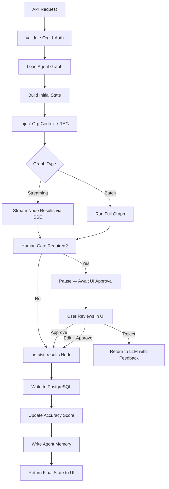
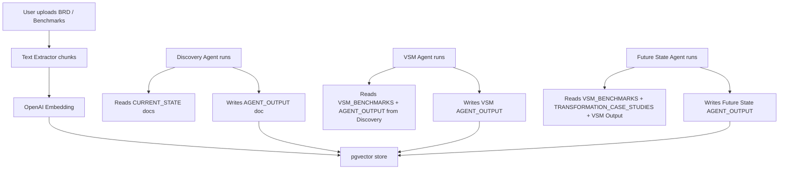
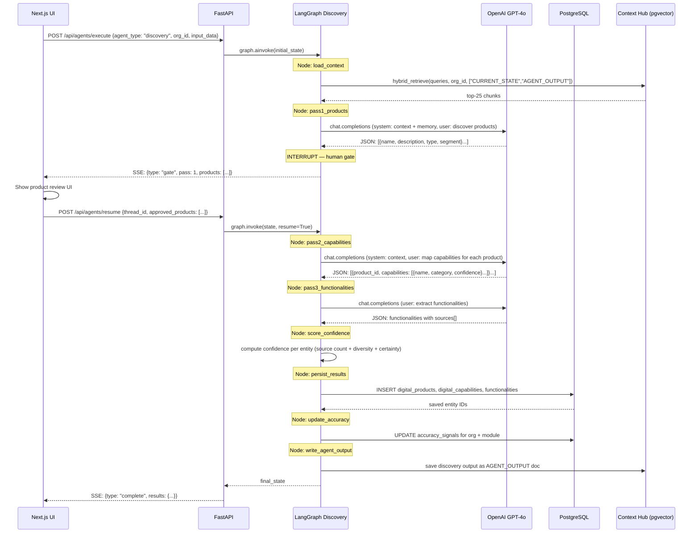

# TransformHub — Multi-Agent Orchestration Architecture

> **Version**: 1.0  |  **Last Updated**: March 2026  |  **Status**: Production

---

## Table of Contents

1. [Overview](#1-overview)
2. [Agent Orchestration Model](#2-agent-orchestration-model)
3. [Agent Catalogue — All 18 Agents](#3-agent-catalogue)
4. [LangGraph State Machine Architecture](#4-langgraph-state-machine-architecture)
5. [Agent Communication & Data Flow](#5-agent-communication--data-flow)
6. [RAG Context Injection](#6-rag-context-injection)
7. [Human-in-the-Loop Gates](#7-human-in-the-loop-gates)
8. [Agent Memory & Feedback Loops](#8-agent-memory--feedback-loops)
9. [Accuracy Scoring per Agent](#9-accuracy-scoring-per-agent)
10. [Error Handling & Retry Logic](#10-error-handling--retry-logic)
11. [Technology Stack per Agent](#11-technology-stack-per-agent)
12. [Orchestration Sequence Diagrams](#12-orchestration-sequence-diagrams)
13. [Agent Performance Benchmarks](#13-agent-performance-benchmarks)
14. [Future Agent Roadmap](#14-future-agent-roadmap)

---

## 1. Overview

TransformHub uses a **multi-agent orchestration architecture** built on **LangGraph 0.1.x**, where each agent is an autonomous, stateful graph that owns a specific transformation intelligence domain. Agents are:

- **Stateful** — maintain intermediate results across graph nodes using TypedDict state schemas
- **Grounded** — all agents inject RAG context from the organisation's Context Hub before calling the LLM
- **Accurate** — every agent output is scored for accuracy, contributing to the per-module composite
- **Auditable** — all agent persist operations write to the SHA-256 chained audit log
- **Memory-aware** — agents read and write to `agent_memories` to improve over time

### Orchestration Principles

| Principle | Description |
|-----------|-------------|
| **Single Responsibility** | Each agent owns exactly one transformation domain |
| **Context-First** | RAG context is injected before every LLM call |
| **Human-in-the-Loop** | Critical transitions require human approval before proceeding |
| **Idempotent** | Re-running an agent on the same input produces consistent, comparable results |
| **Observable** | Every node transition is logged; accuracy is always measurable |
| **Fail-Safe** | Agent failures do not corrupt existing data; partial results are preserved |

### Architecture at a Glance

```
┌─────────────────────────────────────────────────────────────────────┐
│                     TransformHub Agent Platform                     │
│                                                                     │
│  ┌──────────┐    ┌──────────────────────────────────────────────┐  │
│  │  Client  │    │              FastAPI Orchestrator            │  │
│  │  (UI)    │◄──►│  POST /api/agents/execute                    │  │
│  └──────────┘    │  • Validates org context                     │  │
│                  │  • Selects agent graph                        │  │
│                  │  • Streams results back                       │  │
│                  └────────────────┬─────────────────────────────┘  │
│                                   │                                 │
│                  ┌────────────────▼─────────────────────────────┐  │
│                  │           LangGraph Runtime                   │  │
│                  │                                               │  │
│                  │  ┌──────────┐  ┌──────────┐  ┌──────────┐   │  │
│                  │  │Discovery │  │ Lean VSM │  │ Future   │   │  │
│                  │  │  Graph   │  │  Graph   │  │  State   │   │  │
│                  │  └──────────┘  └──────────┘  └──────────┘   │  │
│                  │  ┌──────────┐  ┌──────────┐  ┌──────────┐   │  │
│                  │  │  Risk &  │  │ Product  │  │ Arch-    │   │  │
│                  │  │ Comply   │  │  Trans.  │  │ itecture │   │  │
│                  │  └──────────┘  └──────────┘  └──────────┘   │  │
│                  │  ┌──────────┐  ┌──────────┐  ┌──────────┐   │  │
│                  │  │ Context  │  │  BM25    │  │Accuracy  │   │  │
│                  │  │ Output   │  │ Retrieval│  │ Scorer   │   │  │
│                  │  └──────────┘  └──────────┘  └──────────┘   │  │
│                  └────────────────┬─────────────────────────────┘  │
│                                   │                                 │
│         ┌─────────────────────────▼──────────────────────────┐     │
│         │                Shared Services                      │     │
│         │  PostgreSQL+pgvector │ OpenAI API │ Context Docs   │     │
│         └────────────────────────────────────────────────────┘     │
└─────────────────────────────────────────────────────────────────────┘
```

---

## 2. Agent Orchestration Model

### 2.1 Execution Trigger

Agents are triggered via the unified execution endpoint:

```
POST /api/v1/agents/execute
{
  "agent_type": "discovery" | "lean_vsm" | "future_state_vision" | ...,
  "org_id": "uuid",
  "input_data": { ... agent-specific payload ... }
}
```

The FastAPI orchestrator:
1. Validates the organisation exists and the user has access
2. Loads the appropriate LangGraph graph
3. Prepares the initial state with `org_context` pre-populated
4. Invokes `graph.ainvoke(state)` (async)
5. Returns streaming results via Server-Sent Events (SSE)

### 2.2 Agent Execution Lifecycle



### 2.3 Shared State Schema

All agents operate on a common base state extended with domain-specific fields:

```python
class BaseAgentState(TypedDict):
    # Inputs
    org_id: str
    input_data: Dict[str, Any]

    # Context (populated by load_context node)
    org_context: str          # RAG-retrieved context, formatted
    agent_memories: List[str] # Previous run learnings

    # Execution
    messages: List[BaseMessage]  # LangChain message history
    iteration: int               # For retry/refinement loops

    # Outputs
    results: Dict[str, Any]      # Structured agent output
    error: Optional[str]

    # Metadata
    accuracy_signals: Dict[str, float]  # Signals for accuracy scoring
```

---

## 3. Agent Catalogue

### 3.1 Complete Agent Registry

| # | Agent ID | Graph File | Module | Primary Responsibility |
|---|----------|-----------|--------|------------------------|
| 1 | `discovery` | `discovery/graph.py` | Discovery | Multi-pass AI discovery of products, capabilities, functionalities |
| 2 | `lean_vsm` | `lean_vsm/graph.py` | VSM | Value stream metric generation + Mermaid diagram creation |
| 3 | `future_state_vision` | `future_state_vision/graph.py` | Future State | Benchmark-grounded transformation vision + 3-band projections |
| 4 | `risk_compliance` | `risk_compliance/graph.py` | Risk | Risk identification, scoring, compliance mapping, audit trail |
| 5 | `product_transformation` | `product_transformation/graph.py` | Roadmap | Product transformation roadmap + RICE scoring |
| 6 | `architecture` | `architecture/graph.py` | Workbench | Target architecture design + readiness assessment |
| 7 | `context_output` | `context_output.py` | Context Hub | Auto-save agent outputs as AGENT_OUTPUT context documents |
| 8 | `bm25_retrieval` | `bm25_retrieval.py` | RAG | BM25 keyword reranking over retrieved chunks |
| 9 | `org_context` | `org_context.py` | Cross-cutting | Format and budget RAG context per agent type |
| 10 | `text_extractor` | `text-extractor.ts` | Context Hub | Chunk and index uploaded documents |
| 11 | `accuracy_scorer` | `accuracy/scorer.py` | Accuracy | Compute per-module accuracy from signals |
| 12 | `capability_mapper` | `discovery/capability_mapper.py` | Discovery | Map Pass 2 capability outputs to DB structure |
| 13 | `functionality_extractor` | `discovery/functionality_extractor.py` | Discovery | Extract Pass 3 functionality with source attribution |
| 14 | `vsm_metrics_calculator` | `lean_vsm/metrics.py` | VSM | Compute PT/WT/LT/FE metrics per capability |
| 15 | `mermaid_generator` | `lean_vsm/mermaid.py` | VSM | Generate Mermaid diagram source for each capability VSM |
| 16 | `projection_engine` | `future_state_vision/projections.py` | Future State | Compute Conservative/Expected/Optimistic projection bands |
| 17 | `compliance_mapper` | `risk_compliance/compliance.py` | Risk | Map capabilities to applicable compliance frameworks |
| 18 | `audit_chain` | `risk_compliance/audit.py` | Risk | SHA-256 chained audit log writer |

---

### 3.2 Agent 1 — Discovery

**File**: `agent-service/app/agents/discovery/graph.py`
**Module**: Discovery
**Trigger**: User clicks "Run Discovery" in UI with org + repo URL + segment

#### Scope & Responsibility
Performs a **three-pass AI analysis** of an organisation's technical estate to identify all digital products, their capabilities, and functionalities — with confidence scoring and source triangulation.

#### Pass Structure

```
Pass 1: Digital Product Discovery
  Input:  Repository URLs, org name, business context
  Output: List of digital products (name, description, type, segment)
  Gate:   Human reviews and approves product list before Pass 2

Pass 2: Capability Mapping
  Input:  Approved product list + source systems
  Output: Digital capabilities per product (name, category, confidence, sources)
  Gate:   Human can edit/delete before Pass 3

Pass 3: Functionality Extraction
  Input:  Approved capability list
  Output: Functionalities per capability (name, description, confidence, sources[])
  Auto:   No mandatory gate (runs automatically after Pass 2 approval)
```

#### Graph Nodes

```python
# discovery/graph.py — node sequence
load_context          →  inject RAG context (CURRENT_STATE + AGENT_OUTPUT categories)
pass1_products        →  LLM call: identify digital products from repo analysis
gate_pass1            →  INTERRUPT: pause for human review
pass2_capabilities    →  LLM call: map capabilities per approved product
gate_pass2            →  INTERRUPT (optional): human can review
pass3_functionalities →  LLM call: extract functionalities per capability
score_confidence      →  compute confidence scores (0.0–1.0) per entity
attribute_sources     →  identify which of 8 source types contributed
persist_results       →  save to DB: digital_products, digital_capabilities, functionalities
update_accuracy       →  compute and cache discovery accuracy score
write_agent_output    →  call context_output to save as AGENT_OUTPUT doc
```

#### LangGraph State Schema

```python
class DiscoveryState(BaseAgentState):
    repo_urls: List[str]
    business_segment: str
    approved_products: List[Dict]         # After Pass 1 gate
    approved_capabilities: List[Dict]     # After Pass 2 gate
    functionalities: List[Dict]           # Pass 3 output
    confidence_scores: Dict[str, float]
    source_attribution: Dict[str, List[str]]
    pass1_complete: bool
    pass2_complete: bool
    pass3_complete: bool
```

#### Source Triangulation
Each entity receives sources from up to 8 types:
- `github_structure` — directory layout and file names
- `openapi_spec` — API endpoint paths and schemas
- `db_schema` — database table and column names
- `github_tests` — test file names and test descriptions
- `url_analysis` — public-facing website/docs analysis
- `context_document` — uploaded BRDs/specs in Context Hub
- `integration_data` — integration endpoint patterns
- `questionnaire` — stakeholder-provided answers

**Confidence formula**:
```python
confidence = (
    0.30 * source_count_score +   # more sources = higher confidence
    0.25 * source_diversity_score + # more types = higher confidence
    0.25 * llm_certainty_score +   # LLM self-reported certainty
    0.20 * context_alignment_score  # alignment with RAG context
)
```

#### Technology Stack
- **LangGraph**: State graph with INTERRUPT nodes for human gates
- **OpenAI GPT-4o**: LLM for all three passes
- **PostgreSQL**: persist_results writes to digital_products, digital_capabilities, functionalities
- **pgvector**: Retrieval of CURRENT_STATE and ARCHITECTURE_STANDARDS docs
- **BM25**: Reranking of retrieved chunks (via bm25_retrieval.py)
- **Prisma**: ORM for DB operations (via Python psycopg2 + raw SQL)

---

### 3.3 Agent 2 — Lean VSM

**File**: `agent-service/app/agents/lean_vsm/graph.py`
**Module**: Value Stream Mapping
**Trigger**: User clicks "Run VSM" on a specific digital product

#### Scope & Responsibility
Generates a **three-level value stream map** for all capabilities of a digital product:
- **L1**: Cross-product segment view (flow efficiency summary)
- **L2**: Per-capability metrics (Process Time, Wait Time, Lead Time, Flow Efficiency)
- **L3**: Step-by-step analysis (Value-Adding / Bottleneck / Waste / Waiting)

#### Graph Nodes

```python
load_context          →  inject RAG context (VSM_BENCHMARKS category prioritised)
load_capabilities     →  query DB: all capabilities for the product (via digital_capabilities JOIN digital_products)
generate_vsm_metrics  →  LLM call: generate PT/WT/LT/FE for each capability
classify_steps        →  LLM call: classify each step (Value-Adding/Bottleneck/Waste/Waiting)
generate_mermaid      →  template + LLM: create Mermaid diagram per capability
benchmark_comparison  →  compare against uploaded VSM_BENCHMARKS context docs
persist_results       →  save vsm_metrics table (one row per capability)
update_accuracy       →  compute VSM accuracy score
write_agent_output    →  save full VSM report as AGENT_OUTPUT doc
```

#### Mermaid Generation Pattern

```python
# mermaid.py — template approach
MERMAID_TEMPLATE = """
graph LR
    classDef va fill:#dbeafe,stroke:#2563eb
    classDef bn fill:#fef2f2,stroke:#dc2626
    classDef wt fill:#fefce8,stroke:#ca8a04

    {steps}
    {connections}
    {annotations}
"""

# Each capability gets its own diagram
# Steps labelled with: step_name[PT: Xmin / WT: Xmin]
# Color-coded by classification
```

#### DB Queries (Critical — Fixed Pattern)

```python
# CORRECT: Join via digital_capabilities → digital_products
SELECT dc.* FROM digital_capabilities dc
JOIN digital_products dp ON dc.digital_product_id = dp.id
WHERE dp.id = :product_id AND dp.org_id = :org_id

# VSM steps via product_groups
SELECT vss.* FROM value_stream_steps vss
JOIN product_groups pg ON vss.product_group_id = pg.id
WHERE pg.digital_product_id = :product_id
```

#### Technology Stack
- **LangGraph**: Linear graph (no human gates in standard flow)
- **OpenAI GPT-4o**: Metric generation and step classification
- **PostgreSQL**: Read capabilities, write vsm_metrics
- **BM25 + pgvector**: Retrieve VSM_BENCHMARKS docs for grounding
- **Python Jinja2**: Mermaid template rendering

---

### 3.4 Agent 3 — Future State Vision

**File**: `agent-service/app/agents/future_state_vision/graph.py`
**Module**: Future State
**Trigger**: User clicks "Generate Future State" for a product

#### Scope & Responsibility
Generates a **benchmark-grounded transformation vision** including:
- Automation mix breakdown (RPA/AI-ML/Agent/Conversational/Analytics percentages)
- 3-band projected metrics (Conservative/Expected/Optimistic for FE%, PT, WT)
- Capability modernisation priorities with RICE scores
- Technology stack recommendations

#### Graph Nodes

```python
load_context          →  inject RAG (VSM_BENCHMARKS + TRANSFORMATION_CASE_STUDIES — highest priority)
load_vsm_baseline     →  query vsm_metrics for current-state data
load_capabilities     →  query all capabilities for the product
generate_vision       →  LLM call: generate transformation narrative per product
generate_automation_mix →  LLM call: determine automation approach per capability
run_projections       →  projection_engine: compute 3-band metrics using benchmarks
score_rice            →  LLM + formula: RICE = (Reach × Impact × Confidence) ÷ Effort
persist_results       →  save future_state_visions, projected_metrics tables
update_accuracy       →  compute future state accuracy
write_agent_output    →  save as AGENT_OUTPUT context doc
```

#### Benchmark Grounding

When `VSM_BENCHMARKS` documents are uploaded to Context Hub:
- Agent retrieves benchmark data (industry FE%, PT targets, automation rates)
- Projections are labelled `"Benchmark-grounded"` in the UI
- Without benchmarks: falls back to multiplier-based estimates (FE × 1.8, PT × 0.6 etc.)

#### Projection Engine (`projections.py`)

```python
def compute_projections(baseline_metrics, benchmark_context, automation_mix):
    conservative = {
        "flow_efficiency": baseline * 1.3,   # 30% improvement
        "process_time":    baseline * 0.85,
    }
    expected = {
        "flow_efficiency": baseline * 1.7,   # 70% improvement (benchmark median)
        "process_time":    baseline * 0.65,
    }
    optimistic = {
        "flow_efficiency": baseline * 2.2,   # 120% improvement (benchmark top quartile)
        "process_time":    baseline * 0.45,
    }
    return ProjectedMetrics(conservative, expected, optimistic)
```

#### Technology Stack
- **LangGraph**: Linear graph with optional refinement loop
- **OpenAI GPT-4o**: Vision generation and automation mix analysis
- **BM25 + pgvector**: VSM_BENCHMARKS retrieval (highest context budget: 4k chars)
- **PostgreSQL**: Read vsm_metrics, write future_state outputs
- **Custom projection_engine.py**: Statistical projection computation

---

### 3.5 Agent 4 — Risk & Compliance

**File**: `agent-service/app/agents/risk_compliance/graph.py`
**Module**: Risk & Compliance
**Trigger**: User clicks "Run Risk Assessment" on a product

#### Scope & Responsibility
- AI-powered **risk identification** across all capabilities
- **Risk scoring** (0.0–10.0) with automatic severity classification
- **Compliance framework mapping** (SOX, FDIC, GLBA, GDPR, DORA, HIPAA, PCI-DSS, NIST)
- **SHA-256 chained audit trail** — every state change is cryptographically recorded
- **Risk gate** — CRITICAL score ≥ 8.0 blocks product transformation progression

#### Graph Nodes

```python
load_context          →  inject RAG (CURRENT_STATE + ARCHITECTURE_STANDARDS)
load_capabilities     →  query capabilities + functionalities for the product
identify_risks        →  LLM call: identify risks per capability by category
score_risks           →  LLM + formula: compute risk score 0.0–10.0
classify_severity     →  CRITICAL(≥8.0) / HIGH(6–7.9) / MEDIUM(4–5.9) / LOW(<4)
evaluate_gates        →  check if any CRITICAL risks present
map_compliance        →  compliance_mapper: map to applicable frameworks per org industry
write_audit_chain     →  audit_chain: SHA-256 hash each state change
persist_results       →  save risk_assessments, compliance_mappings, audit_logs
update_accuracy       →  compute risk accuracy score
```

#### SHA-256 Audit Chain (`audit.py`)

```python
def write_audit_entry(org_id, entity_type, entity_id, action, data):
    # Retrieve previous hash for this org
    prev_entry = get_latest_audit_entry(org_id)
    prev_hash = prev_entry.curr_hash if prev_entry else "0" * 64

    # Compute new hash
    payload = f"{prev_hash}|{entity_type}|{entity_id}|{action}|{json.dumps(data)}|{timestamp}"
    curr_hash = hashlib.sha256(payload.encode()).hexdigest()

    # Write immutable entry
    insert_audit_log(org_id, entity_type, entity_id, action, prev_hash, curr_hash)
    return curr_hash
```

#### Risk Gate Logic

```python
# In evaluate_gates node:
critical_risks = [r for r in risks if r.score >= 8.0]
if critical_risks:
    state["transformation_blocked"] = True
    state["blocking_risks"] = critical_risks
    # UI shows "Transformation BLOCKED" indicator
    # product_transformation agent will check this flag before executing
```

#### Technology Stack
- **LangGraph**: Stateful graph with audit chain integration
- **OpenAI GPT-4o**: Risk identification and scoring
- **PostgreSQL**: risk_assessments, compliance_mappings, audit_logs (append-only)
- **Python hashlib**: SHA-256 implementation
- **BM25 + pgvector**: CURRENT_STATE docs for risk context

---

### 3.6 Agent 5 — Product Transformation

**File**: `agent-service/app/agents/product_transformation/graph.py`
**Module**: Product Roadmap
**Trigger**: User generates roadmap from Future State + Risk outputs

#### Scope & Responsibility
- Constructs a **RICE-scored transformation roadmap** for a product
- Assigns initiatives to **quarterly delivery tracks**
- Generates **approval workflow** (Draft → Under Review → Approved → In Progress → Done)
- Checks **risk gate** before proceeding (blocked if CRITICAL risks unresolved)

#### Graph Nodes

```python
check_risk_gate       →  verify no CRITICAL risks blocking this product
load_context          →  inject RAG (TRANSFORMATION_CASE_STUDIES prioritised)
load_future_state     →  query future_state_visions + projected_metrics
load_capabilities     →  all capabilities with modernisation scores
generate_initiatives  →  LLM call: generate transformation initiatives
score_rice            →  RICE = (Reach × Impact × Confidence) ÷ Effort
assign_quarters       →  assign initiatives to Q1–Q4 based on RICE + dependencies
build_roadmap         →  structure quarterly delivery tracks
persist_results       →  save roadmap_items with status = DRAFT
update_accuracy       →  compute PT accuracy score
```

#### Technology Stack
- **LangGraph**: Conditional graph (checks risk gate first)
- **OpenAI GPT-4o**: Initiative generation and prioritisation
- **PostgreSQL**: roadmap_items table with RICE scores
- **RICE Calculator**: Custom Python module

---

### 3.7 Agent 6 — Architecture

**File**: `agent-service/app/agents/architecture/graph.py`
**Module**: Product Workbench
**Trigger**: User requests architecture assessment

#### Scope & Responsibility
- Generates **target architecture recommendations** per product
- Assesses **technology readiness** against current capabilities
- Produces **integration architecture patterns**
- Creates **readiness scores** per capability

#### Graph Nodes

```python
load_context          →  inject RAG (ARCHITECTURE_STANDARDS — highest priority)
load_capabilities     →  load all capabilities + current tech indicators
assess_readiness      →  LLM call: score each capability for transformation readiness
design_target_arch    →  LLM call: propose target architecture per product
recommend_tech_stack  →  LLM call: technology stack recommendations
generate_patterns     →  LLM call: integration patterns and API design
persist_results       →  save architecture_recommendations, readiness_scores
update_accuracy       →  compute architecture accuracy
```

#### Technology Stack
- **LangGraph**: Linear graph with optional deep-dive branches
- **OpenAI GPT-4o**: Architecture generation
- **BM25 + pgvector**: ARCHITECTURE_STANDARDS retrieval (e.g., uploaded ADRs, patterns docs)
- **PostgreSQL**: architecture outputs storage

---

### 3.8 Agent 7 — Context Output

**File**: `agent-service/app/agents/context_output.py`
**Module**: Cross-cutting (called by all agents)
**Trigger**: Automatically called at end of every agent's persist_results node

#### Scope & Responsibility
Auto-saves significant agent outputs as **`AGENT_OUTPUT` category documents** in the Context Hub. This creates a **self-improving knowledge loop**: each agent run enriches the context available to future runs.

```python
def save_agent_context_doc(org_id, agent_type, output_data, title):
    """
    Converts structured agent output to a searchable context document.
    Category: AGENT_OUTPUT
    Status: INDEXED (immediate, no re-embedding needed — stored as plain text chunks)
    """
    text = format_output_as_text(agent_type, output_data)
    chunks = chunk_text(text, chunk_size=2000, overlap=400)
    embeddings = embed_chunks(chunks)  # OpenAI text-embedding-3-small
    store_context_document(org_id, title, "AGENT_OUTPUT", chunks, embeddings)
```

**Self-improvement loop**:
```
Run 1: Discovery outputs saved → Context Hub
Run 2: VSM reads Discovery context → better grounding
Run 3: Future State reads VSM + Discovery context → better projections
Run N: Each subsequent run is better informed than the last
```

---

### 3.9 Agent 8 — BM25 Retrieval

**File**: `agent-service/app/agents/bm25_retrieval.py`
**Module**: Cross-cutting (used by lean_vsm, future_state_vision)
**Role**: Hybrid retrieval reranker

#### Scope & Responsibility
After vector similarity search retrieves initial chunks, BM25 **reranks** them using keyword relevance, then the top-N by combined score are selected:

```python
def hybrid_retrieve(query, org_id, top_k=25, category_filter=None):
    # Step 1: Vector similarity search
    vector_results = pgvector_search(query, org_id, top_k=50, category=category_filter)

    # Step 2: BM25 keyword ranking
    corpus = [r.content for r in vector_results]
    bm25 = BM25Okapi([doc.split() for doc in corpus])
    bm25_scores = bm25.get_scores(query.split())

    # Step 3: Combine scores
    combined = [
        (r, 0.7 * r.similarity + 0.3 * bm25_scores[i])
        for i, r in enumerate(vector_results)
    ]

    # Step 4: Return top-K by combined score
    return sorted(combined, key=lambda x: x[1], reverse=True)[:top_k]
```

#### Technology Stack
- **rank_bm25**: Python BM25Okapi implementation
- **pgvector**: Vector similarity via `<=>` operator (cosine distance)
- **OpenAI text-embedding-3-small**: Query embedding

---

### 3.10 Agent 9 — Org Context

**File**: `agent-service/app/core/org_context.py`
**Module**: Cross-cutting (called by all agents before LLM call)

#### Scope & Responsibility
Formats and **budgets RAG context** per agent type. Different agents get different context category priorities and character budgets:

```python
CONTEXT_BUDGETS = {
    "discovery":           {"CURRENT_STATE": 4000, "AGENT_OUTPUT": 2000, "total": 8000},
    "lean_vsm":            {"VSM_BENCHMARKS": 4000, "CURRENT_STATE": 2000, "total": 8000},
    "future_state_vision": {"VSM_BENCHMARKS": 3000, "TRANSFORMATION_CASE_STUDIES": 3000, "total": 10000},
    "risk_compliance":     {"CURRENT_STATE": 3000, "ARCHITECTURE_STANDARDS": 2000, "total": 8000},
    "product_transformation": {"TRANSFORMATION_CASE_STUDIES": 3000, "AGENT_OUTPUT": 2000, "total": 8000},
    "architecture":        {"ARCHITECTURE_STANDARDS": 5000, "CURRENT_STATE": 2000, "total": 10000},
}

def format_context_section(input_data, agent_type="discovery"):
    budget = CONTEXT_BUDGETS[agent_type]
    chunks = hybrid_retrieve(build_queries(input_data, agent_type), ...)
    return format_into_sections(chunks, budget)
```

---

### 3.11 Supporting Agents (10–18)

| # | Agent | File | Responsibility |
|---|-------|------|----------------|
| 10 | Text Extractor | `text-extractor.ts` | Chunk documents (2k chars, 400 overlap) for Context Hub indexing |
| 11 | Accuracy Scorer | `accuracy/scorer.py` | Compute per-module accuracy from confidence + source + run signals |
| 12 | Capability Mapper | `discovery/capability_mapper.py` | Map LLM capability output to DB schema (name → ID resolution) |
| 13 | Functionality Extractor | `discovery/functionality_extractor.py` | Pass 3 extraction with source type attribution |
| 14 | VSM Metrics Calculator | `lean_vsm/metrics.py` | Compute PT/WT/LT/FE from LLM output + scaling factors |
| 15 | Mermaid Generator | `lean_vsm/mermaid.py` | Produce valid Mermaid diagram source per capability |
| 16 | Projection Engine | `future_state_vision/projections.py` | Compute 3-band projections (Conservative/Expected/Optimistic) |
| 17 | Compliance Mapper | `risk_compliance/compliance.py` | Map risks to applicable frameworks per industry/org |
| 18 | Audit Chain | `risk_compliance/audit.py` | SHA-256 chained immutable audit log writer |

---

## 4. LangGraph State Machine Architecture

### 4.1 Graph Structure Pattern

All agents follow a consistent LangGraph graph construction pattern:

```python
# Canonical agent graph structure
from langgraph.graph import StateGraph, END
from langgraph.checkpoint.memory import MemorySaver

def build_graph(state_schema):
    workflow = StateGraph(state_schema)

    # Add nodes
    workflow.add_node("load_context", load_context_node)
    workflow.add_node("main_inference", main_inference_node)
    workflow.add_node("persist_results", persist_results_node)
    workflow.add_node("update_accuracy", update_accuracy_node)

    # Set entry point
    workflow.set_entry_point("load_context")

    # Add edges
    workflow.add_edge("load_context", "main_inference")
    workflow.add_edge("main_inference", "persist_results")
    workflow.add_edge("persist_results", "update_accuracy")
    workflow.add_edge("update_accuracy", END)

    # For agents with human gates (discovery):
    workflow.add_conditional_edges(
        "pass1_products",
        should_interrupt,  # returns "gate_pass1" or "pass2_capabilities"
        {"gate_pass1": "gate_pass1", "continue": "pass2_capabilities"}
    )
    workflow.add_node("gate_pass1", human_gate_node)  # INTERRUPT node

    return workflow.compile(checkpointer=MemorySaver())
```

### 4.2 INTERRUPT Pattern (Human Gates)

```python
from langgraph.types import interrupt

def human_gate_node(state: DiscoveryState):
    """Pause execution and return results to UI for human review."""
    # This node calls interrupt() which suspends the graph
    # The UI receives the current state and shows the review UI
    # When user approves, graph.invoke() is called with updated state to resume
    human_input = interrupt({
        "type": "gate_review",
        "pass": state["current_pass"],
        "results": state["pending_results"],
        "message": "Please review and approve these results before continuing."
    })
    # Update state with human edits
    state["approved_results"] = human_input["approved"]
    return state
```

### 4.3 State Persistence

LangGraph uses `MemorySaver` for in-process state during an agent run. For cross-request state (human gates), the state is serialised to PostgreSQL:

```python
# Checkpoint storage for human gate persistence
class PostgresCheckpointer:
    """Custom LangGraph checkpointer that saves state to PostgreSQL."""
    async def put(self, config, checkpoint, metadata):
        await db.execute(
            "INSERT INTO agent_checkpoints (thread_id, state, metadata) VALUES ($1, $2, $3)",
            config["thread_id"], json.dumps(checkpoint), json.dumps(metadata)
        )
    async def get(self, config):
        row = await db.fetchone("SELECT state FROM agent_checkpoints WHERE thread_id = $1",
                                config["thread_id"])
        return json.loads(row["state"]) if row else None
```

---

## 5. Agent Communication & Data Flow

### 5.1 Inter-Agent Data Flow

Agents do **not call each other directly**. They communicate through the shared PostgreSQL database:

```
Discovery Agent
    ↓ writes to: digital_products, digital_capabilities, functionalities

Lean VSM Agent
    ↑ reads from: digital_capabilities (via JOIN with digital_products)
    ↓ writes to: vsm_metrics

Future State Vision Agent
    ↑ reads from: vsm_metrics, digital_capabilities
    ↓ writes to: future_state_visions, projected_metrics

Risk Compliance Agent
    ↑ reads from: digital_capabilities, digital_products
    ↓ writes to: risk_assessments, compliance_mappings, audit_logs

Product Transformation Agent
    ↑ reads from: future_state_visions, risk_assessments (gate check)
    ↓ writes to: roadmap_items

Architecture Agent
    ↑ reads from: digital_capabilities, digital_products
    ↓ writes to: architecture_recommendations
```

### 5.2 Context Hub — Continuous Enrichment



---

## 6. RAG Context Injection

### 6.1 Multi-Query Strategy

Each agent generates **3–5 queries** to retrieve diverse, relevant context:

```python
AGENT_QUERIES = {
    "discovery": lambda input_data: [
        f"digital products and capabilities for {input_data['org_name']}",
        f"business processes in {input_data['business_segment']} segment",
        f"API endpoints and services for {input_data['repo_name']}",
        f"transformation context for {input_data['industry']}",
    ],
    "lean_vsm": lambda input_data: [
        f"value stream benchmarks for {input_data['product_name']}",
        f"process time and flow efficiency industry standards",
        f"lean value stream mapping best practices",
        f"bottleneck identification and waste elimination",
    ],
    "future_state_vision": lambda input_data: [
        f"digital transformation outcomes for {input_data['industry']}",
        f"automation ROI and flow efficiency improvement benchmarks",
        f"AI and RPA implementation in {input_data['business_segment']}",
        f"target state architecture patterns",
        f"transformation case studies similar to {input_data['org_name']}",
    ],
}
```

### 6.2 Retrieval Pipeline

```
1. Generate 3-5 queries from input_data
2. For each query:
   a. Compute query embedding (OpenAI text-embedding-3-small)
   b. Vector search: top-50 chunks by cosine similarity (pgvector)
   c. Apply category filter (e.g., only VSM_BENCHMARKS for lean_vsm)
3. Union all results (deduplicated by chunk_id)
4. BM25 rerank: apply BM25 score against all queries
5. Combined score: 0.7 × vector + 0.3 × BM25
6. Select top-25 by combined score
7. Truncate to context budget (per agent type, max 12k chars total)
8. Format via format_context_section() with section headers
```

---

## 7. Human-in-the-Loop Gates

### Gate Configuration per Agent

| Agent | Gate Point | What User Reviews | Can Edit? | Can Reject? |
|-------|-----------|-------------------|-----------|-------------|
| Discovery | After Pass 1 | Product list | Yes (name, desc, delete) | Yes (triggers re-run) |
| Discovery | After Pass 2 | Capabilities | Yes | Yes |
| Risk | After risk scoring | Risk register | Yes (mitigation text) | No (scores are computed) |
| Roadmap | After RICE scoring | Initiative list | Yes (quarter, priority) | No |
| Architecture | After design | Architecture recs | Yes | Yes |

### Gate Rejection Flow

When a user rejects a gate:
1. Rejection reason is captured as free text
2. Rejection is saved as `agent_memories` entry
3. Next run of the same agent injects the rejection reason into the prompt
4. Agent improves its output based on the feedback

```python
# agent_memories entry on rejection:
{
    "org_id": "...",
    "agent_type": "discovery",
    "key": "pass1_rejection_feedback",
    "value": "Products list missed the mobile banking app — look for 'mobile' in repo name"
}
```

---

## 8. Agent Memory & Feedback Loops

### Memory Architecture

```python
# Agent memory is read at the start of every agent run:
def load_agent_memories(org_id, agent_type):
    memories = db.query("""
        SELECT key, value FROM agent_memories
        WHERE org_id = :org_id AND agent_type = :agent_type
        ORDER BY created_at DESC LIMIT 10
    """, org_id=org_id, agent_type=agent_type)
    return "\n".join([f"- {m.key}: {m.value}" for m in memories])

# Injected into system prompt:
system_prompt = f"""
You are an AI transformation intelligence agent.

Previous learnings for this organisation:
{agent_memories}

Context from uploaded documents:
{rag_context}

[... rest of prompt ...]
"""
```

### Feedback Sources

| Source | Trigger | Memory Key |
|--------|---------|-----------|
| Gate rejection | User rejects pass output | `{pass}_rejection_feedback` |
| Entity edit | User edits AI-generated name/desc | `entity_edit_correction` |
| Manual accuracy action | User flags inaccurate output | `accuracy_correction` |
| Re-run improvement | Consultant notes improvement | `consultant_feedback` |

---

## 9. Accuracy Scoring per Agent

### Accuracy Signal Collection

Each agent collects signals during execution that feed the accuracy scorer:

```python
# Signals written to state["accuracy_signals"]
accuracy_signals = {
    "confidence_mean": mean([e.confidence for e in entities]),
    "source_diversity": len(set(all_sources)) / 8.0,  # 8 possible source types
    "context_alignment": rag_relevance_score,
    "human_edits": human_edit_count / total_entities,  # inversely weighted
    "run_success": 1.0 if no_errors else 0.5,
}
```

### Per-Module Accuracy Formula

```python
ACCURACY_WEIGHTS = {
    "discovery":              0.20,
    "lean_vsm":               0.18,
    "future_state":           0.15,
    "knowledge_base":         0.15,
    "risk_compliance":        0.12,
    "product_transformation": 0.12,
    "architecture":           0.08,
}

def compute_module_accuracy(org_id, module):
    signals = get_latest_signals(org_id, module)
    score = (
        0.40 * signals["confidence_mean"] +
        0.25 * signals["source_diversity"] +
        0.20 * signals["run_success"] +
        0.15 * (1 - signals["human_edit_rate"])
    )
    return min(score * 100, 100)  # as percentage
```

---

## 10. Error Handling & Retry Logic

### Node-Level Error Handling

```python
def main_inference_node(state):
    for attempt in range(3):
        try:
            response = openai_client.chat.completions.create(
                model="gpt-4o",
                messages=state["messages"],
                response_format={"type": "json_object"},
                timeout=60,
            )
            return parse_and_validate(response)
        except RateLimitError:
            time.sleep(2 ** attempt)  # exponential backoff
        except ValidationError as e:
            # Retry with clarification prompt
            state["messages"].append({"role": "user", "content": f"Fix this: {e}"})

    # After 3 failures: partial result with error flag
    state["error"] = "LLM call failed after 3 retries"
    return state
```

### Failure Modes & Recovery

| Failure | Recovery Strategy | Data Impact |
|---------|-------------------|-------------|
| LLM timeout | Retry × 3 with backoff | No data written |
| LLM hallucination (invalid JSON) | Retry with correction prompt | No data written |
| DB write failure | Transaction rollback | Previous data preserved |
| OpenAI rate limit | Queue and retry (2s, 4s, 8s) | Delayed, not lost |
| Mid-graph failure | State checkpointed; resume from last node | Partial state preserved |
| Human gate timeout | Graph remains paused indefinitely | State preserved in checkpoint |

---

## 11. Technology Stack per Agent

| Component | Technology | Version | Purpose |
|-----------|-----------|---------|---------|
| Agent Framework | LangGraph | 0.1.x | State machine orchestration |
| LLM | OpenAI GPT-4o | Latest | All inference calls |
| Embeddings | OpenAI text-embedding-3-small | Latest | Document and query embedding |
| Vector Store | pgvector (PostgreSQL extension) | 0.5+ | Similarity search |
| BM25 | rank_bm25 | 0.2.2 | Keyword relevance scoring |
| DB ORM | psycopg2 + raw SQL | 2.9+ | Agent DB operations |
| Chunking | Custom Python | — | 2k chars, 400 overlap |
| Checkpointing | LangGraph MemorySaver + PostgreSQL | — | Human gate state persistence |
| API Runtime | FastAPI | 0.115 | Agent execution endpoint |
| Async Runtime | Python asyncio + uvicorn | — | Concurrent agent execution |
| Diagram Generation | Mermaid (text templates) | — | VSM diagram source |
| Hashing | Python hashlib (SHA-256) | stdlib | Audit trail |
| Retry Logic | tenacity | 8.2+ | LLM call retry with backoff |

---

## 12. Orchestration Sequence Diagrams

### Full Discovery Flow (Multi-Pass with Human Gates)



---

## 13. Agent Performance Benchmarks

| Agent | Typical Run Time | Repo Size | LLM Calls | DB Writes |
|-------|-----------------|-----------|-----------|-----------|
| Discovery (all 3 passes) | 3–5 min | 100 files | 3–5 calls | 100–400 rows |
| Lean VSM | 45–90 sec | 26 capabilities | 2–3 calls | 26–78 rows |
| Future State Vision | 60–120 sec | 9 products | 3–4 calls | 27–45 rows |
| Risk & Compliance | 30–60 sec | 26 capabilities | 2–3 calls | 10–40 rows |
| Product Transformation | 30–45 sec | 9 products | 2 calls | 9–36 rows |
| Architecture | 45–75 sec | 26 capabilities | 3 calls | 26 rows |
| Context Hub (doc upload) | 5–15 sec | 100-page PDF | 0 calls* | 48 rows |
| Accuracy Scoring (uncached) | < 2 sec | any | 0 calls | 0 rows |
| Accuracy Scoring (cached) | < 200 ms | any | 0 calls | 0 rows |

*Embedding calls are batched separately

---

## 14. Future Agent Roadmap

| Phase | Agent | Description |
|-------|-------|-------------|
| v1.1 | `benchmark_discovery` | Auto-discover industry benchmarks from public sources |
| v1.1 | `slack_notifier` | Push agent completion events to Slack/Teams |
| v1.2 | `portfolio_vsm` | Cross-org, portfolio-level value stream analysis |
| v1.2 | `fine_tuner` | Fine-tune per-org model from correction history |
| v1.2 | `custom_compliance` | Build custom compliance frameworks from uploaded policies |
| v2.0 | `autonomous_orchestrator` | Trigger agent pipeline automatically on repo changes |
| v2.0 | `monitoring_agent` | Continuously monitor production metrics against target state |
| v2.0 | `executive_narrator` | Auto-generate natural language board narrative from data |
| v2.0 | `market_intelligence` | Benchmark against anonymised cross-client aggregate data |
